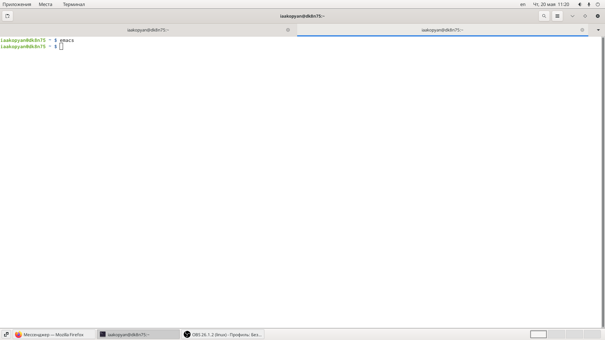
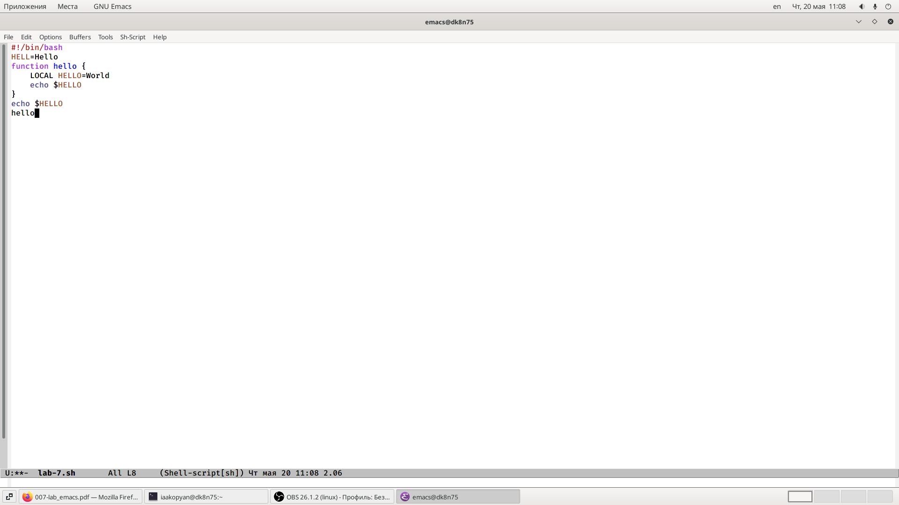
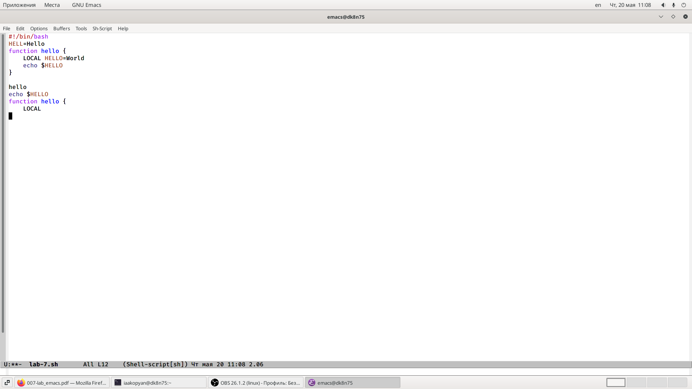
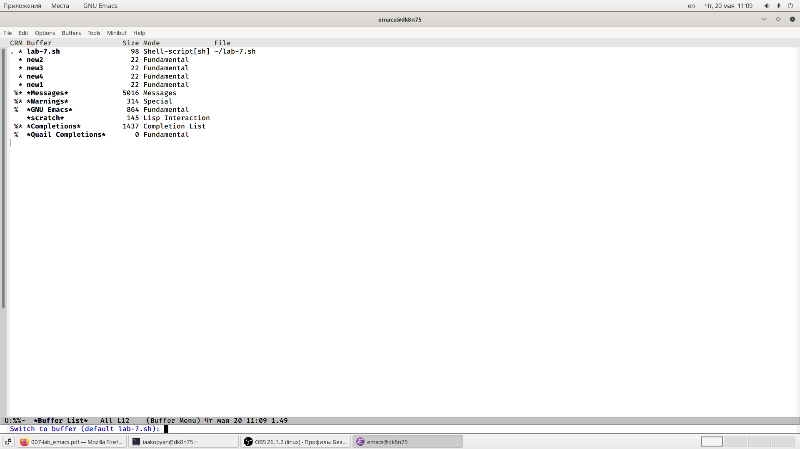
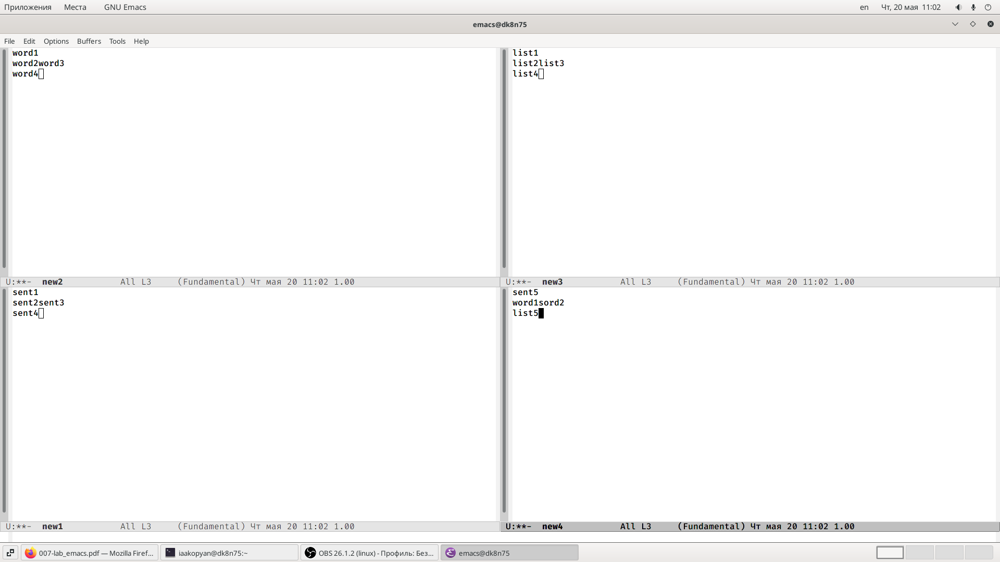
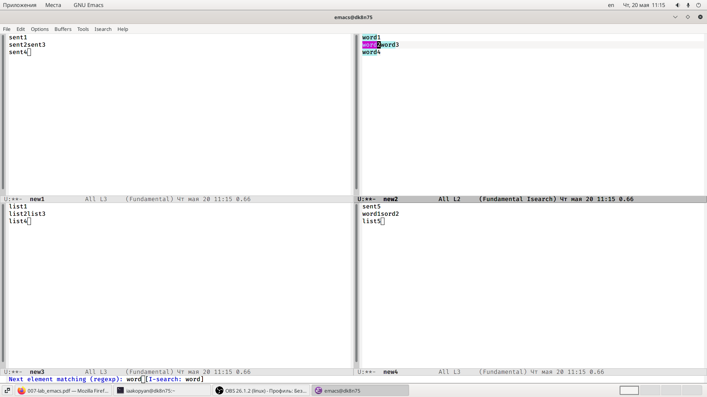
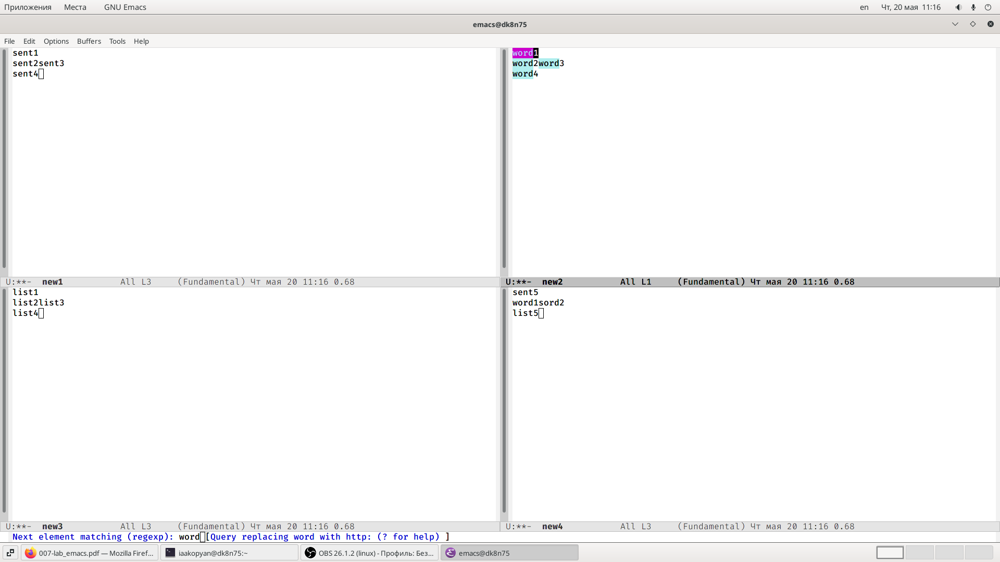
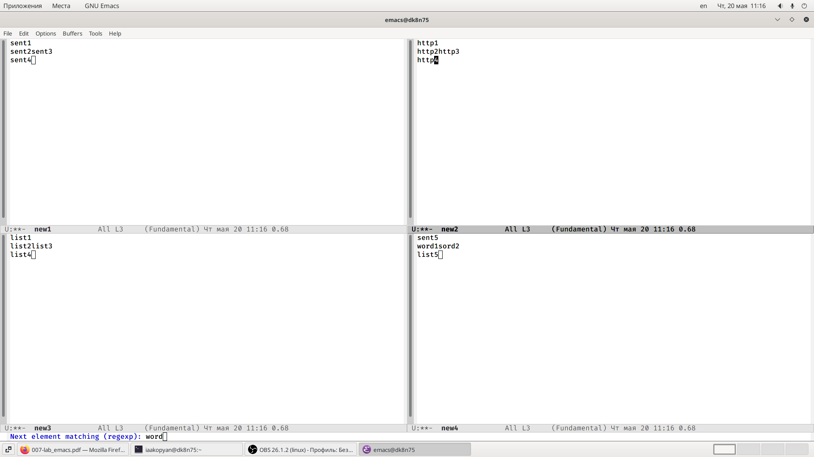
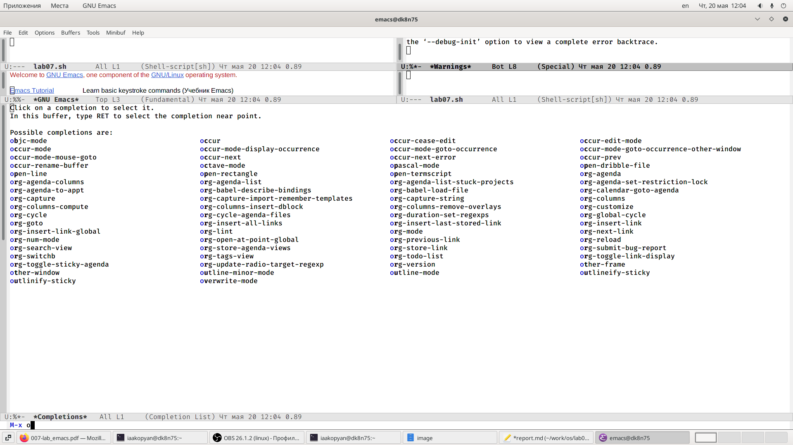

---
# Front matter
lang: ru-RU
title: "Лабораторная работа 10"
subtitle: "Текстовой редактор emacs"
author: "Акопян Изабелла Арменовна"

# Formatting
toc-title: "Содержание"
toc: true # Table of contents
toc_depth: 2
lof: true # List of figures
lot: true # List of tables
fontsize: 12pt
linestretch: 1.5
papersize: a4paper
documentclass: scrreprt
polyglossia-lang: russian
polyglossia-otherlangs: english
mainfont: PT Serif
romanfont: PT Serif
sansfont: PT Sans
monofont: PT Mono
mainfontoptions: Ligatures=TeX
romanfontoptions: Ligatures=TeX
sansfontoptions: Ligatures=TeX,Scale=MatchLowercase
monofontoptions: Scale=MatchLowercase
indent: true
pdf-engine: lualatex
header-includes:
  - \linepenalty=10 # the penalty added to the badness of each line within a paragraph (no associated penalty node) Increasing the value makes tex try to have fewer lines in the paragraph.
  - \interlinepenalty=0 # value of the penalty (node) added after each line of a paragraph.
  - \hyphenpenalty=50 # the penalty for line breaking at an automatically inserted hyphen
  - \exhyphenpenalty=50 # the penalty for line breaking at an explicit hyphen
  - \binoppenalty=700 # the penalty for breaking a line at a binary operator
  - \relpenalty=500 # the penalty for breaking a line at a relation
  - \clubpenalty=150 # extra penalty for breaking after first line of a paragraph
  - \widowpenalty=150 # extra penalty for breaking before last line of a paragraph
  - \displaywidowpenalty=50 # extra penalty for breaking before last line before a display math
  - \brokenpenalty=100 # extra penalty for page breaking after a hyphenated line
  - \predisplaypenalty=10000 # penalty for breaking before a display
  - \postdisplaypenalty=0 # penalty for breaking after a display
  - \floatingpenalty = 20000 # penalty for splitting an insertion (can only be split footnote in standard LaTeX)
  - \raggedbottom # or \flushbottom
  - \usepackage{float} # keep figures where there are in the text
  - \floatplacement{figure}{H} # keep figures where there are in the text
---

# Цель работы

- Познакомиться с операционной системой Linux. 
- Получить практические навыки работы с редактором Emacs.

# Задание

- Открыть emacs.
- Создать файл.
- Набрать в нем текст.
- Сохранить файл.
- Проделать с текстом стандартные процедуры редактирования.
- Использовать команды по перемещению курсора.
- Управлять буферами.
- Управлять окнами.
- Использовать режим поиска.

# Выполнение лабораторной работы

Ознакомилась в материалами лабораторной работы ( [ссылка 2](https://esystem.rudn.ru/pluginfile.php/1142514/mod_resource/content/3/007-lab_emacs.pdf) ) и приступила к выполнению заданий.

Открыла emacs. (рис. -@fig:001)

{ #fig:001 width=70% }

Создала файл lab07.sh с помощью комбинации (Ctrl-x, Ctrl-f). (рис. -@fig:001)

Набрала текст:

>#!/bin/bash

>HELL=Hello

>function hello {

>    LOCAL HELLO=World

>    echo $HELLO

>}

>echo $HELLO

>hello

{ #fig:002 width=70% }

Сохранила файл с помощью комбинации (Ctrl-x, Ctrl-s).

Вырезала одной командой целую строку (С-k).

Вставила эту строку в конец файла (C-y).

Выделила область текста (C-space).

Скопировала область в буфер обмена (M-w).

Вставила область в конец файла.

Вновь выделила эту область и на этот раз вырезала её (C-w).

Отменила последнее действие (C-/). (рис. -@fig:003)

{ #fig:003 width=70% }

Переместила курсор в начало строки (C-a).

Переместила курсор в конец строки (C-e).

Переместила курсор в начало буфера (M-<).

Переместила курсор в конец буфера (M->).

Вывела список активных буферов на экран (C-x C-b). (рис. -@fig:004)

{ #fig:004 width=70% }

Переместилась во вновь открытое окно (C-o) со списком открытых буферов и переключилась на другой буфер.

Закрыла это окно (C-x 0).

Теперь вновь переключилась между буферами, но уже без вывода их списка на экран (C-x b).

Поделила фрейм на 4 части: по вертикали(C-x 3), по горизонтали (C-x 2).

В каждом из четырёх созданных окон открылв новый буфер (файл) и ввела несколько строк текста. (рис. -@fig:005)

Здесь мне понадобилась сторонняя помощь, мне помог сайт ( [ссылка 1](https://alexott.net/ru/emacs/emacs-manual/emacs_20.html) ).

{ #fig:005 width=70% }

Переключилась в режим поиска (C-s) и нашла несколько слов, присутствующих в тексте. (рис. -@fig:006)

Переключилась между результатами поиска, нажимая C-s.

{ #fig:006 width=70% }

Вышла из режима поиска, нажав C-g.

Перешла в режим поиска и замены (M-%), ввела текст, который следует найти и заменить, нажала Enter, затем ввела текст для замены. После того как будут подсвечены результаты поиска, нажала ! для подтверждения замены. (рис. -@fig:007)  (рис. -@fig:008)

{ #fig:007 width=70% }

{ #fig:008 width=70% }

Испробовала другой режим поиска, нажав M-x o. Совершился поиск по первой букве 'o'. (рис. -@fig:009)

{ #fig:009 width=70% }

# Выводы

- Успешно выполнила поставленные задачи.
- Познакомилась с операционной системой Linux. 
- Получила практические навыки работы с редактором Emacs.

# Библиография

[ссылка 1](https://alexott.net/ru/emacs/emacs-manual/emacs_20.html)
[ссылка 2](https://esystem.rudn.ru/pluginfile.php/1142514/mod_resource/content/3/007-lab_emacs.pdf)

