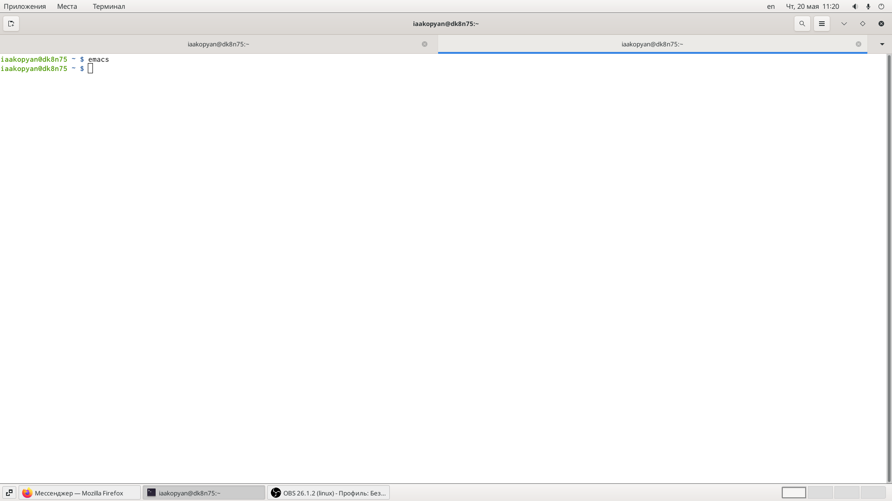
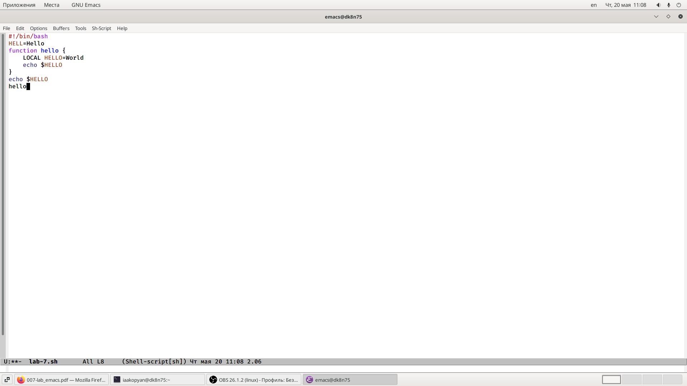
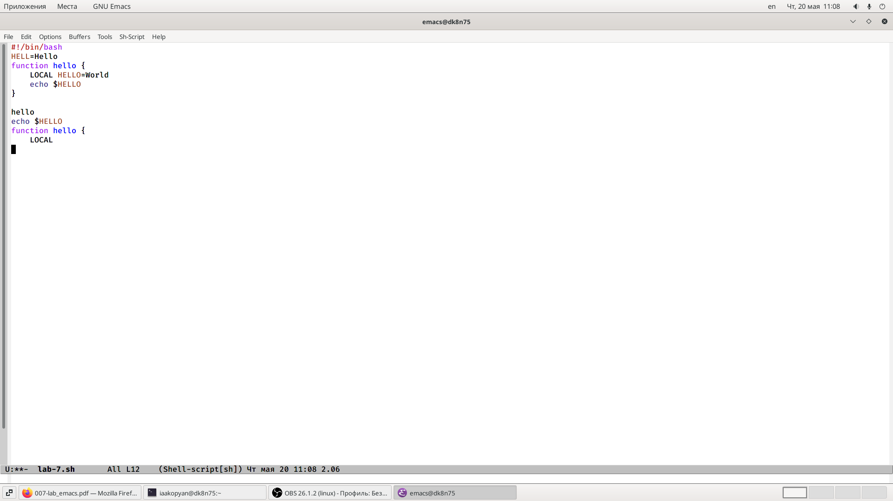
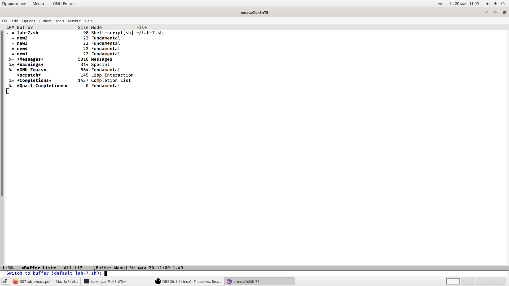
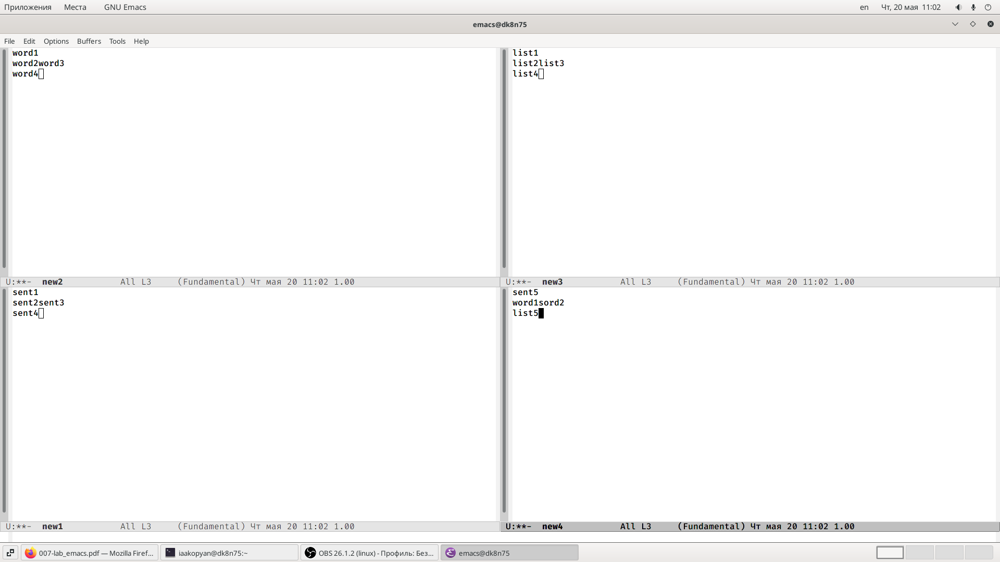
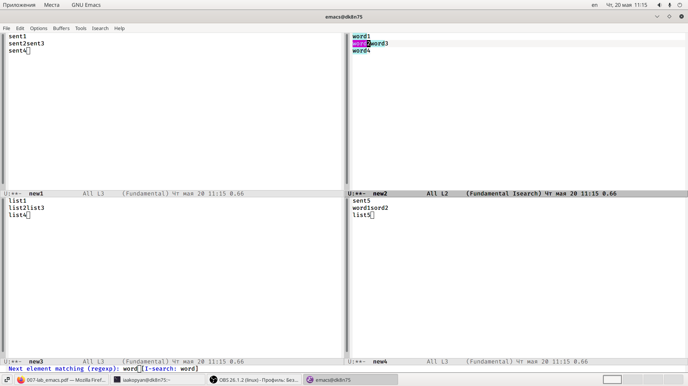
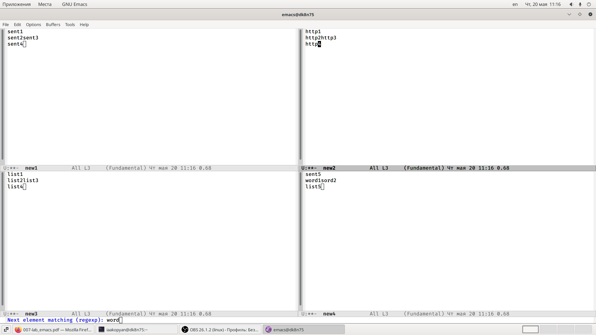
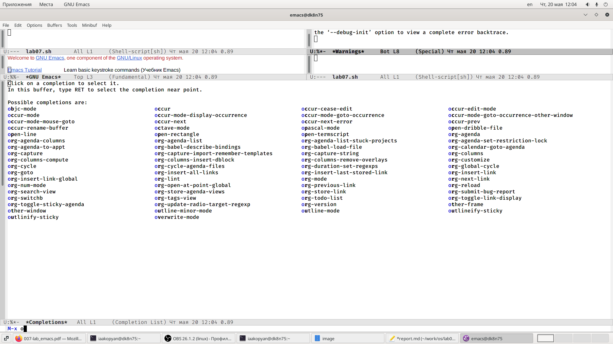

---
## Front matter
lang: ru-RU
title: Лабораторная работа 10
author: |
	Акопян Изабелла Арменовна\inst{}
institute: |
	\inst{}RUDN University, Moscow, Russian Federation

date: 2021, 20 Мая

## Formatting
toc: false
slide_level: 2
theme: metropolis
header-includes: 
 - \metroset{progressbar=frametitle,sectionpage=progressbar,numbering=fraction}
 - '\makeatletter'
 - '\beamer@ignorenonframefalse'
 - '\makeatother'
aspectratio: 43
section-titles: true
---

# Текстовой редактор emacs

## Цель

- Познакомиться с операционной системой Linux. 

- Получить практические навыки работы с редактором Emacs.

## Задачи

- Открыть emacs.
- Создать файл.
- Набрать в нем текст.
- Сохранить файл.
- Проделать с текстом стандартные процедуры редактирования.
- Использовать команды по перемещению курсора.
- Управлять буферами.
- Управлять окнами.
- Использовать режим поиска.

## Выполнение лабораторной работы (1/4)

{ #fig:001 width=70% }
{ #fig:002 width=70% }

## (2/4)

{ #fig:003 width=70% }
{ #fig:004 width=70% }

## (3/4)

{ #fig:005 width=70% }
{ #fig:006 width=70% }

## (4/4)
{ #fig:008 width=70% }
{ #fig:009 width=70% }

## Выводы

- Успешно выполнила поставленные задачи.
- Познакомилась с операционной системой Linux. 
- Получила практические навыки работы с редактором Emacs.

## Библиография

[ссылка 1](https://alexott.net/ru/emacs/emacs-manual/emacs_20.html)
[ссылка 2](https://esystem.rudn.ru/pluginfile.php/1142514/mod_resource/content/3/007-lab_emacs.pdf)

