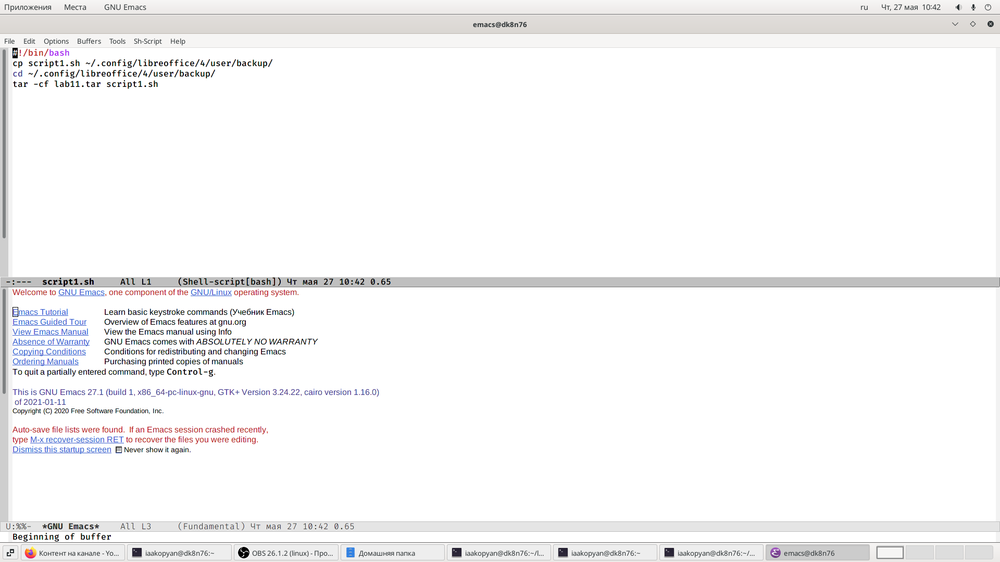
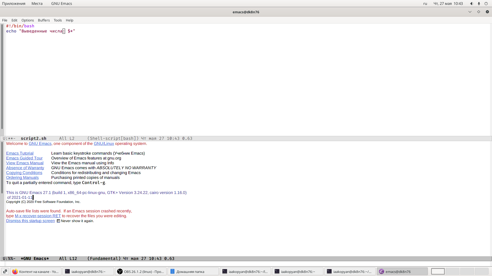
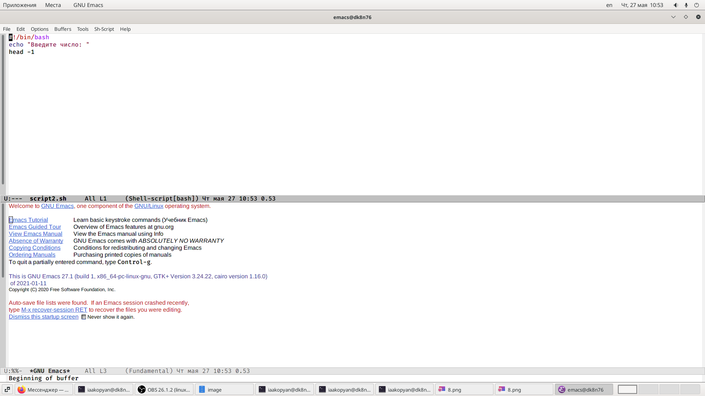
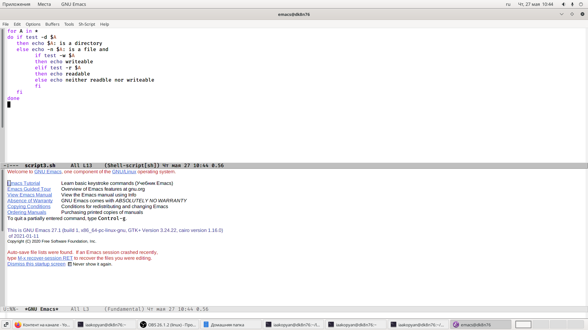
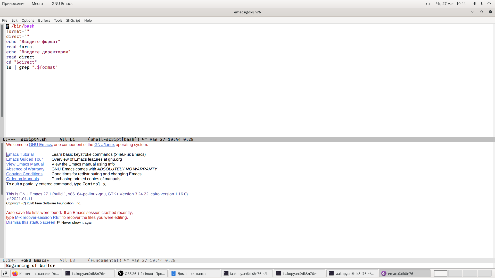
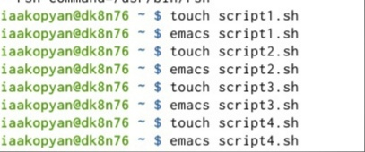
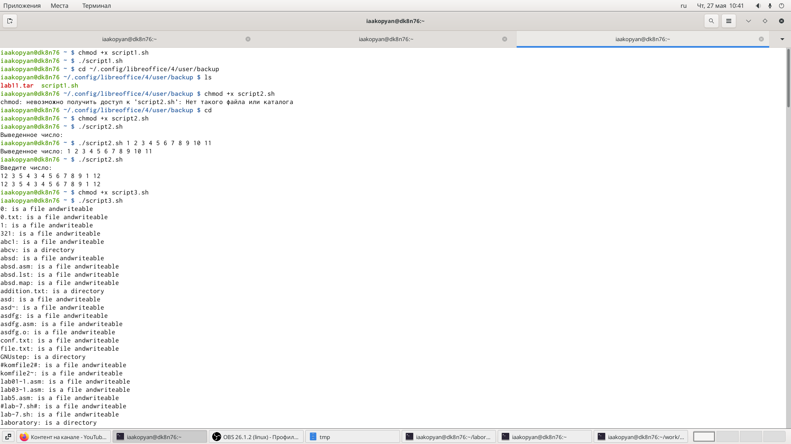
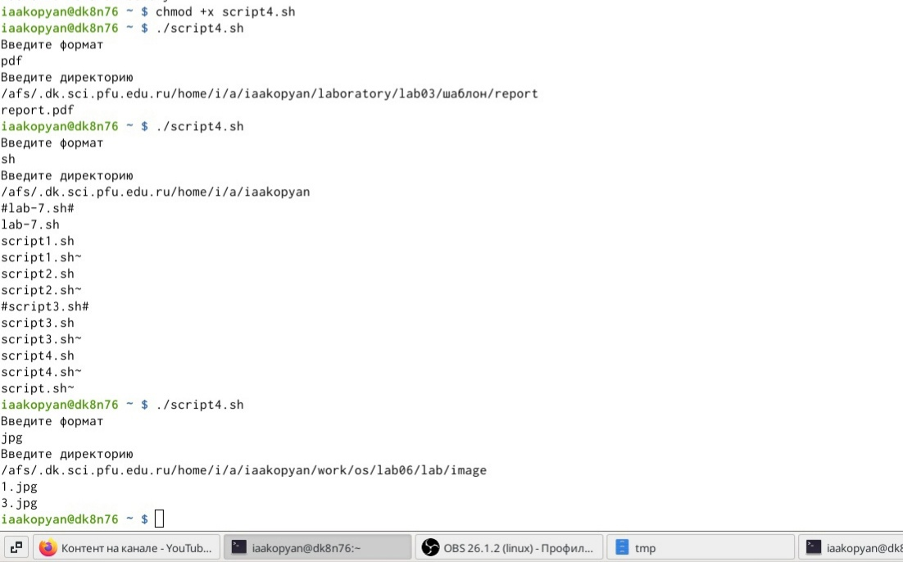

---
## Front matter
lang: ru-RU
title: Лабораторная работа 11
author: |
	Акопян Изабелла Арменовна\inst{}
institute: |
	\inst{}RUDN University, Moscow, Russian Federation

date: 2021, 20 Мая

## Formatting
toc: false
slide_level: 2
theme: metropolis
header-includes: 
 - \metroset{progressbar=frametitle,sectionpage=progressbar,numbering=fraction}
 - '\makeatletter'
 - '\beamer@ignorenonframefalse'
 - '\makeatother'
aspectratio: 43
section-titles: true
---

# Программирование в командном процессоре ОС UNIX. Командные файлы.

## Цель

- Изучить основы программирования в оболочке ОС UNIX/Linux.
- Научиться писать небольшие командные файлы. 

## Задачи

1. Написать скрипты, командные файлы.

2. Просмотреть файл лабораторной.

3. Вызвать скрипты.

## Выполнение лабораторной работы (1/4)

{ #fig:002 width=70% }

## (2/4)

{ #fig:003 width=70% }
{ #fig:004 width=70% }

## (3/4)

{ #fig:005 width=70% }

## (4/4) 

{ #fig:006 width=70% }

## Команды

{ #fig:007 width=70% }

##

{ #fig:008 width=70% }
{ #fig:009 width=70% }

## Выводы

- Я успешно изучила основы программирования в оболочке ОС UNIX/Linux.
- Научилась писать небольшие командные файлы.

## Библиография

>[Ссылка1](https://esystem.rudn.ru/pluginfile.php/1142517/mod_resource/content/2/008-lab_shell_prog_1.pdf)

>[Ссылка2](https://losst.ru/napisanie-skriptov-na-bash)
