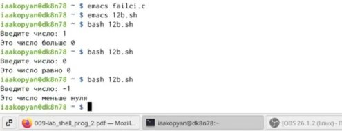

---
# Front matter
lang: ru-RU
title: "Лабораторная работа 12"
subtitle: "Программирование в командном процессоре ОС UNIX. Ветвления и циклы"
author: "Акопян Изабелла Арменовна"

# Formatting
toc-title: "Содержание"
toc: true # Table of contents
toc_depth: 2
lof: true # List of figures
lot: true # List of tables
fontsize: 12pt
linestretch: 1.5
papersize: a4paper
documentclass: scrreprt
polyglossia-lang: russian
polyglossia-otherlangs: english
mainfont: PT Serif
romanfont: PT Serif
sansfont: PT Sans
monofont: PT Mono
mainfontoptions: Ligatures=TeX
romanfontoptions: Ligatures=TeX
sansfontoptions: Ligatures=TeX,Scale=MatchLowercase
monofontoptions: Scale=MatchLowercase
indent: true
pdf-engine: lualatex
header-includes:
  - \linepenalty=10 # the penalty added to the badness of each line within a paragraph (no associated penalty node) Increasing the value makes tex try to have fewer lines in the paragraph.
  - \interlinepenalty=0 # value of the penalty (node) added after each line of a paragraph.
  - \hyphenpenalty=50 # the penalty for line breaking at an automatically inserted hyphen
  - \exhyphenpenalty=50 # the penalty for line breaking at an explicit hyphen
  - \binoppenalty=700 # the penalty for breaking a line at a binary operator
  - \relpenalty=500 # the penalty for breaking a line at a relation
  - \clubpenalty=150 # extra penalty for breaking after first line of a paragraph
  - \widowpenalty=150 # extra penalty for breaking before last line of a paragraph
  - \displaywidowpenalty=50 # extra penalty for breaking before last line before a display math
  - \brokenpenalty=100 # extra penalty for page breaking after a hyphenated line
  - \predisplaypenalty=10000 # penalty for breaking before a display
  - \postdisplaypenalty=0 # penalty for breaking after a display
  - \floatingpenalty = 20000 # penalty for splitting an insertion (can only be split footnote in standard LaTeX)
  - \raggedbottom # or \flushbottom
  - \usepackage{float} # keep figures where there are in the text
  - \floatplacement{figure}{H} # keep figures where there are in the text
---

# Цель работы

- Изучить основы программирования в оболочке ОС UNIX. 
- Научится писать более сложные командные файлы с использованием логических управляющих конструкций и циклов. 

# Задание

- написать 4 командных файла.
- написать программу на Си.
- работа с файлом .txt.

# Выполнение лабораторной работы

Ознакомилась в материалами лабораторной работы ( [ссылка 1](https://esystem.rudn.ru/pluginfile.php/1142520/mod_resource/content/3/009-lab_shell_prog_2.pdf) ) и приступила к выполнению заданий.

Используя команды getopts grep, написала командный файл (рис. 1), который анализирует командную строку с ключами -i, -o, -p, -C, -n. Сначала создала текстовый файл (рис. 2). (рис. 3)

{ #fig:001 width=70% }

{ #fig:002 width=70% }

{ #fig:003 width=70% }

Написала на языке Си программу (рис. 5), которая вводит число и определяет, является ли оно больше нуля, меньше нуля или равно нулю. Затем программа завершается с помощью функции exit(n), передавая информацию о коде завершения в оболочку. Командный файл (рис. 4) вызывает эту программу и, проанализировал с помощью команды $?, выдал сообщение о том, какое число было введено. (рис. 6)

Написать программу на Си мне помог сайт. [ссылка 2](https://istarik.ru/blog/programmirovanie/13.html)

{ #fig:004 width=70% }

{ #fig:005 width=70% }

{ #fig:006 width=70% }

Написала командный файл (рис. 7), создающий указанное число файлов, пронумерованных последовательно от 1 до N. Число файлов, которые было необходимо создать, передавалось в аргументы командной строки. Этот же командный файл умеет удалять все созданные им файлы (если они существуют). (рис. 8)

{ #fig:007 width=70% }

{ #fig:008 width=70% }

Написала командный файл (рис. 9), который с помощью команды tar запаковывает в архив все файлы в указанной директории. Модифицировала его так, чтобы запаковывались только те файлы, которые были изменены менее недели тому назад (использовала команду find). (рис. 10)

{ #fig:009 width=70% }

{ #fig:0010 width=70% }

Результат (рис. 11) (рис. 12):

{ #fig:011 width=70% }

{ #fig:012 width=70% }

# Выводы

- Я успешно изучила основы программирования в оболочке ОС UNIX.
- Научилась писать более сложные командные файлы с использованием логических управляющих конструкций и циклов. 

# Библиография

[ссылка 2](https://istarik.ru/blog/programmirovanie/13.html)
[ссылка 1](https://esystem.rudn.ru/pluginfile.php/1142520/mod_resource/content/3/009-lab_shell_prog_2.pdf)

