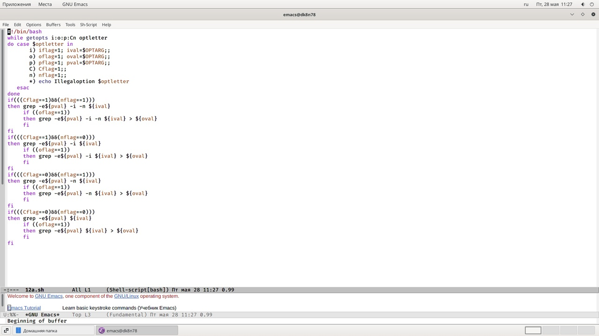
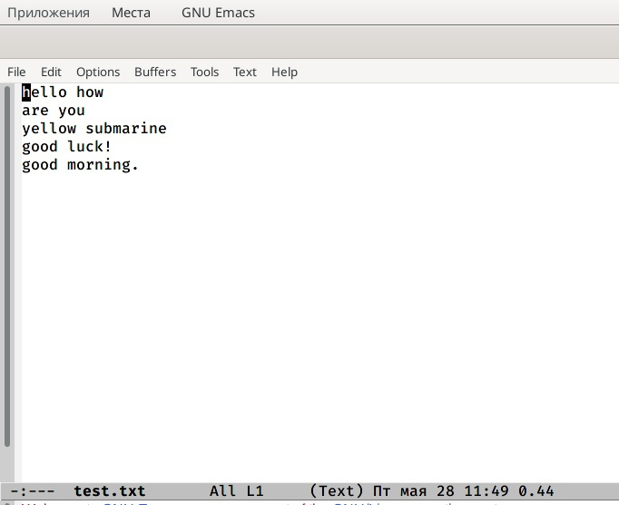
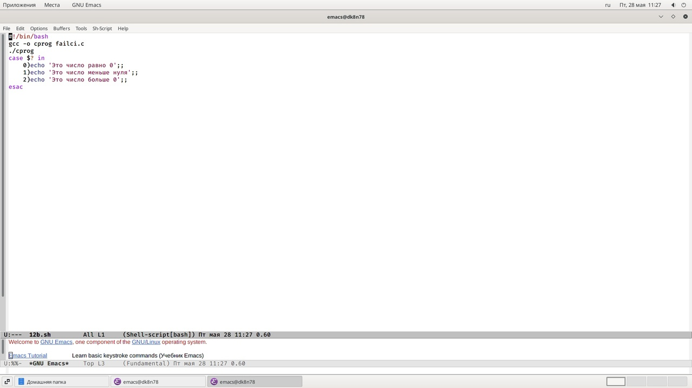
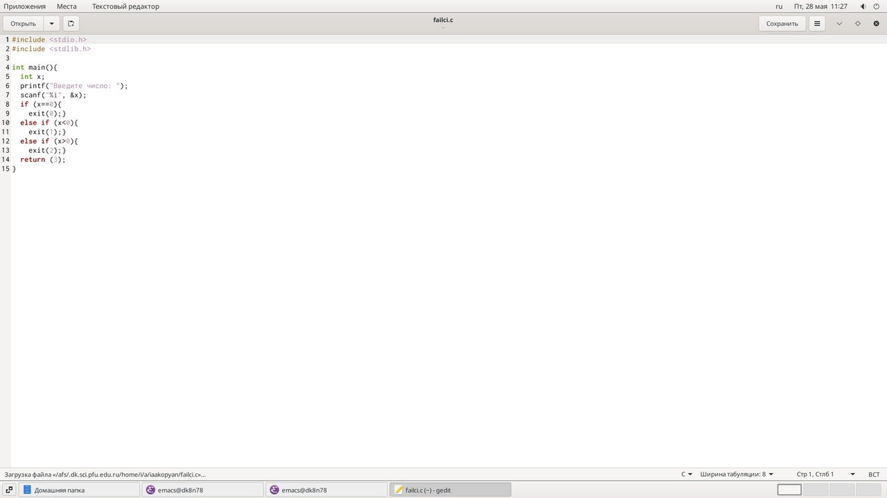
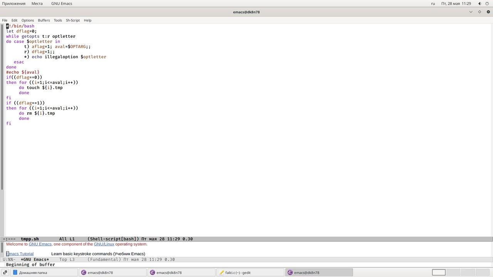
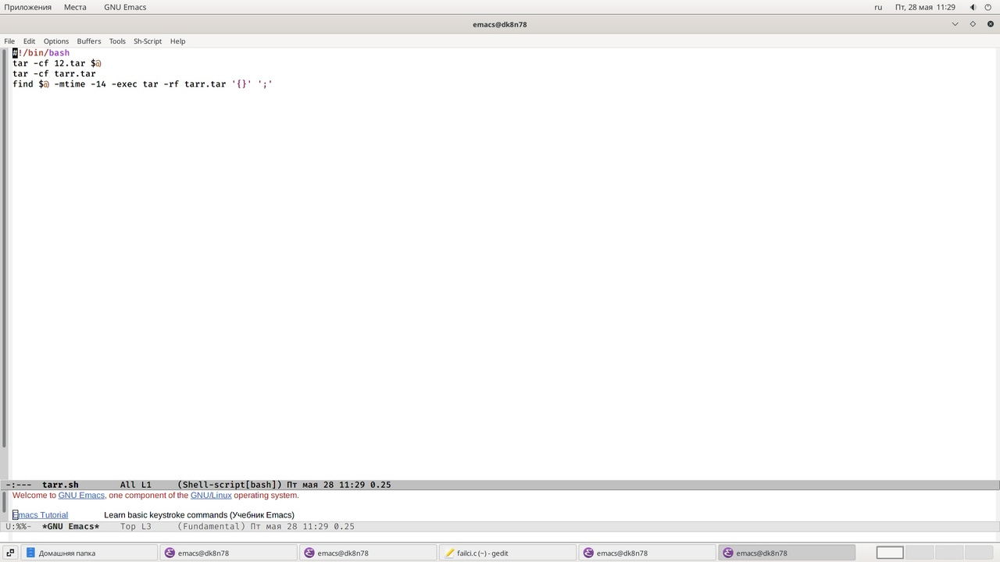

---
## Front matter
lang: ru-RU
title: Лабораторная работа 12
author: |
	Акопян Изабелла Арменовна\inst{}
institute: |
	\inst{}RUDN University, Moscow, Russian Federation

date: 2021, 28 Мая

## Formatting
toc: false
slide_level: 2
theme: metropolis
header-includes: 
 - \metroset{progressbar=frametitle,sectionpage=progressbar,numbering=fraction}
 - '\makeatletter'
 - '\beamer@ignorenonframefalse'
 - '\makeatother'
aspectratio: 43
section-titles: true
---

# Программирование в командном процессоре ОС UNIX. Ветвления и циклы

## Цель

- Изучить основы программирования в оболочке ОС UNIX. 

- Научится писать более сложные командные файлы с использованием логических управляющих конструкций и циклов. 

## Задачи

- написать 4 командных файла.

- написать программу на Си.

- работа с файлом .txt.

## Выполнение лабораторной работы (1/4)

{ #fig:001 width=70% }
{ #fig:002 width=70% }

## (2/4)

{ #fig:004 width=70% }}
{ #fig:005 width=70% }

## (3/4)

{ #fig:007 width=70% }

## (4/4)

{ #fig:009 width=70% }

## Выводы

- Я успешно изучила основы программирования в оболочке ОС UNIX.
- Научилась писать более сложные командные файлы с использованием логических управляющих конструкций и циклов. 

## Библиография

[ссылка 2](https://istarik.ru/blog/programmirovanie/13.html)
[ссылка 1](https://esystem.rudn.ru/pluginfile.php/1142520/mod_resource/content/3/009-lab_shell_prog_2.pdf)

