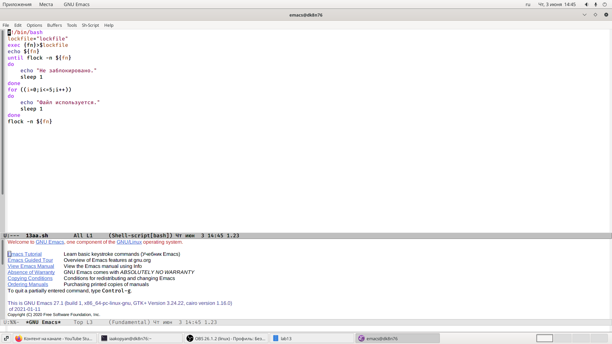
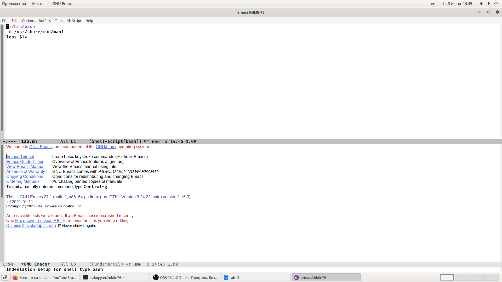
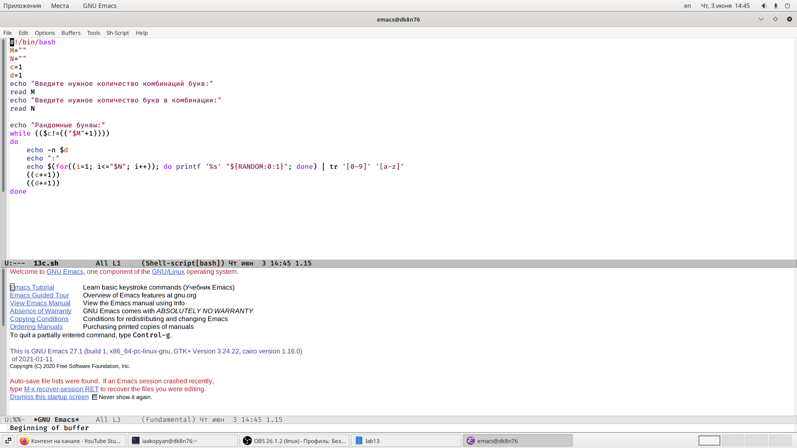

---
## Front matter
lang: ru-RU
title: Лабораторная работа 13
author: |
	Акопян Изабелла Арменовна\inst{}
institute: |
	\inst{}RUDN University, Moscow, Russian Federation

date: 2021, 4 Июня

## Formatting
toc: false
slide_level: 2
theme: metropolis
header-includes: 
 - \metroset{progressbar=frametitle,sectionpage=progressbar,numbering=fraction}
 - '\makeatletter'
 - '\beamer@ignorenonframefalse'
 - '\makeatother'
aspectratio: 43
section-titles: true
---

# Программирование в командном процессоре ОС UNIX. Расширенное программирование.

## Цель

- Изучить основы программирования в оболочке ОС UNIX.
- Научиться писать более сложные командные файлы с использованием логических управляющих конструкций и циклов.

## Задачи

1. Написать командный файл, реализующий упрощенный механизм семафоров.

2. Реализовать команду man с помощью командного файла.

3. Используя встроенную переменную $RANDOM, написать командный файл, генерирующий случайную последовательность букв.

## Выполнение лабораторной работы (1/3)

{ #fig:002 width=70% }

## (2/3)

{ #fig:004 width=70% }

## (3/3) 

{ #fig:006 width=70% }

## Выводы

- Изучила основы программирования в оболочке ОС UNIX.
- Научилась писать более сложные командные файлы с использованием логических управляющих конструкций и циклов.

## Библиография

[ссылка 1](https://esystem.rudn.ru/pluginfile.php/1142523/mod_resource/content/2/010-lab_shell_prog_3.pdf)

[ссылка 2](https://andreyex.ru/linux/komandy-linux-i-komandy-shell/ispolzovanie-komandy-sleep-v-skriptah-bash-v-linux/)

[ссылка 3](https://pingtool.org/ru/using-flock-to-ensure-only-one-instance-of-script-is-running/)
