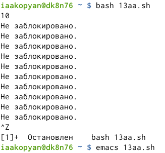
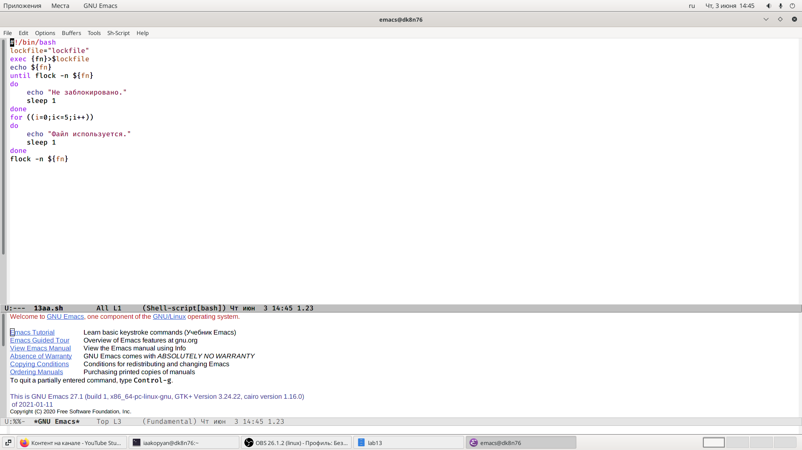
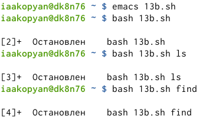
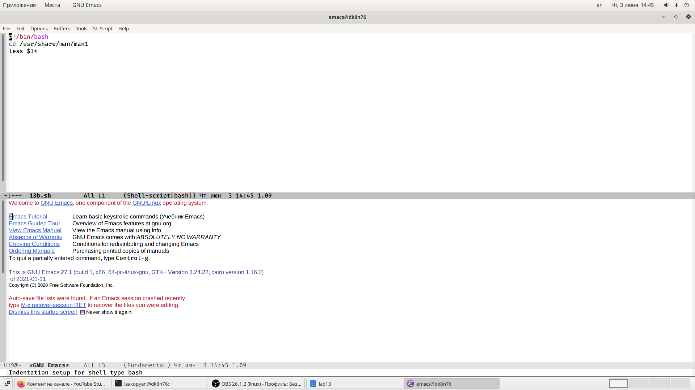
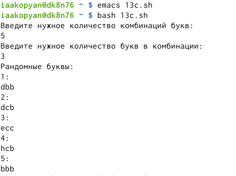
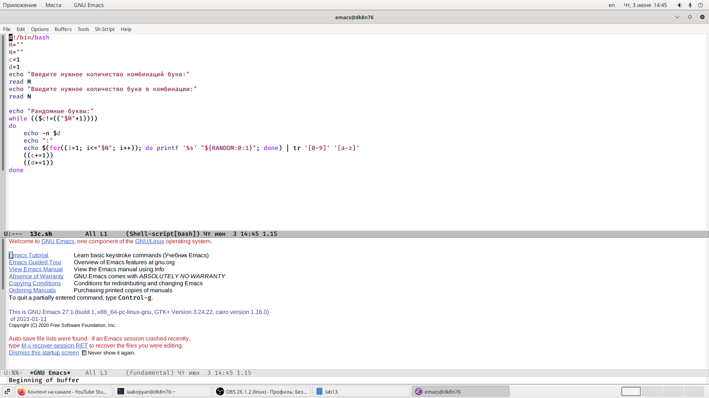

---
# Front matter
lang: ru-RU
title: "Лабораторная работа №13"
subtitle: "Программирование в командном процессоре ОС UNIX. Расширенное программирование."
author: "Акопян Изабелла Арменовна"

# Formatting
toc-title: "Содержание"
toc: true # Table of contents
toc_depth: 2
lof: true # List of figures
lot: true # List of tables
fontsize: 12pt
linestretch: 1.5
papersize: a4paper
documentclass: scrreprt
polyglossia-lang: russian
polyglossia-otherlangs: english
mainfont: PT Serif
romanfont: PT Serif
sansfont: PT Sans
monofont: PT Mono
mainfontoptions: Ligatures=TeX
romanfontoptions: Ligatures=TeX
sansfontoptions: Ligatures=TeX,Scale=MatchLowercase
monofontoptions: Scale=MatchLowercase
indent: true
pdf-engine: lualatex
header-includes:
  - \linepenalty=10 # the penalty added to the badness of each line within a paragraph (no associated penalty node) Increasing the value makes tex try to have fewer lines in the paragraph.
  - \interlinepenalty=0 # value of the penalty (node) added after each line of a paragraph.
  - \hyphenpenalty=50 # the penalty for line breaking at an automatically inserted hyphen
  - \exhyphenpenalty=50 # the penalty for line breaking at an explicit hyphen
  - \binoppenalty=700 # the penalty for breaking a line at a binary operator
  - \relpenalty=500 # the penalty for breaking a line at a relation
  - \clubpenalty=150 # extra penalty for breaking after first line of a paragraph
  - \widowpenalty=150 # extra penalty for breaking before last line of a paragraph
  - \displaywidowpenalty=50 # extra penalty for breaking before last line before a display math
  - \brokenpenalty=100 # extra penalty for page breaking after a hyphenated line
  - \predisplaypenalty=10000 # penalty for breaking before a display
  - \postdisplaypenalty=0 # penalty for breaking after a display
  - \floatingpenalty = 20000 # penalty for splitting an insertion (can only be split footnote in standard LaTeX)
  - \raggedbottom # or \flushbottom
  - \usepackage{float} # keep figures where there are in the text
  - \floatplacement{figure}{H} # keep figures where there are in the text
---

# Цель работы

Изучить основы программирования в оболочке ОС UNIX. Научиться писать более сложные командные файлы с использованием логических управляющих конструкций и циклов.

# Задание

1. Написать командный файл, реализующий упрощенный механизм семафоров.

2. Реализовать команду man с помощью командного файла.

3. Используя встроенную переменную $RANDOM, написать командный файл, генерирующий случайную последовательность букв.

# Выполнение лабораторной работы

Ознакомившись с материалами лабораторной работы №13 ([ссылка 1](https://esystem.rudn.ru/pluginfile.php/1142523/mod_resource/content/2/010-lab_shell_prog_3.pdf)), приступила к выполнению заданий.

Написала командный файл, реализующий упрощенный механизм семафоров (рис. -@fig:001) (рис. -@fig:002). 

С этой программой мне помогли немного сторонние сайты ([ссылка 2](https://andreyex.ru/linux/komandy-linux-i-komandy-shell/ispolzovanie-komandy-sleep-v-skriptah-bash-v-linux/)) и ([ссылка 3](https://pingtool.org/ru/using-flock-to-ensure-only-one-instance-of-script-is-running/)).

Здесь я использовала команду sleep, она вводит задержку на указанное время. Без опций число рядом с командой написано в секундах.

Команда flock - устанавливает или снимает advisory блокировку на открытый файл.

Программа работает немного некорректно. Получается бесконечный цикл.

{ #fig:001 width=70% }

{ #fig:002 width=70% }

Реализовала команду man, используя less (рис. -@fig:003) (рис. -@fig:004).
Программа переходит в каталог /usr/share/man/man1. Там находятся справки о командах. И командой less считывает содержимое. Если справка не найдена, выведется сообщение.

{ #fig:003 width=70% }

{ #fig:004 width=70% }

Написала командный файл, используя встроенную переменную RANDOM (рис. -@fig:005) (рис. -@fig:006). Пользователь вводит количество комбинаций и количество букв в комбинации, а программа выводит эти рандомные комбинации букв.
$RANDOM выдает псевдослучайные числа в диапозоне от 0 до 32767.

{ #fig:005 width=70% }

{ #fig:006 width=70% }

# Выводы

Изучила основы программирования в оболочке ОС UNIX. Научилась писать более сложные командные файлы с использованием логических управляющих конструкций и циклов.

# Библиография

[ссылка 1](https://esystem.rudn.ru/pluginfile.php/1142523/mod_resource/content/2/010-lab_shell_prog_3.pdf)

[ссылка 2](https://andreyex.ru/linux/komandy-linux-i-komandy-shell/ispolzovanie-komandy-sleep-v-skriptah-bash-v-linux/)

[ссылка 3](https://pingtool.org/ru/using-flock-to-ensure-only-one-instance-of-script-is-running/)
