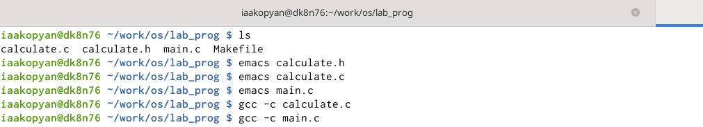
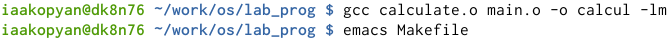
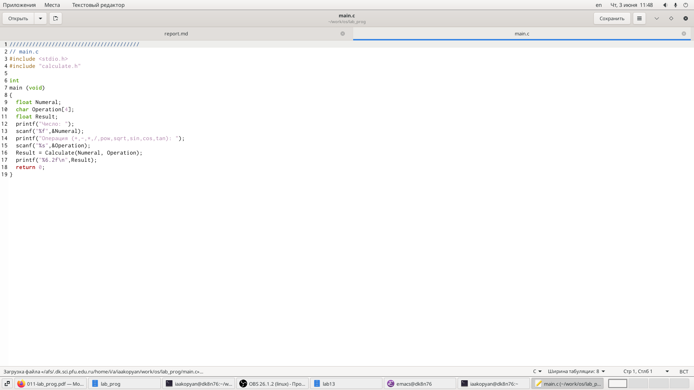
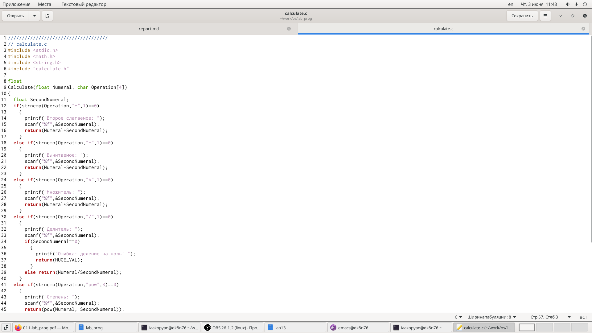
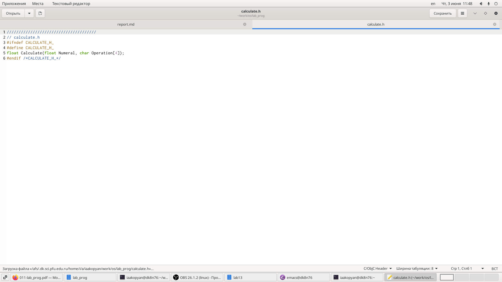
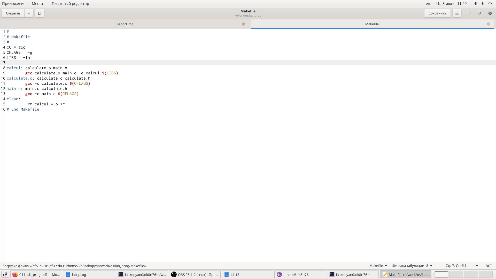
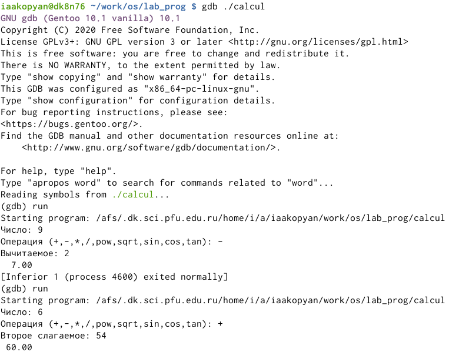
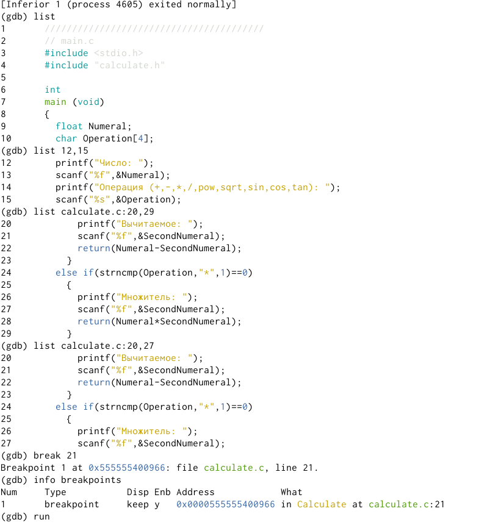
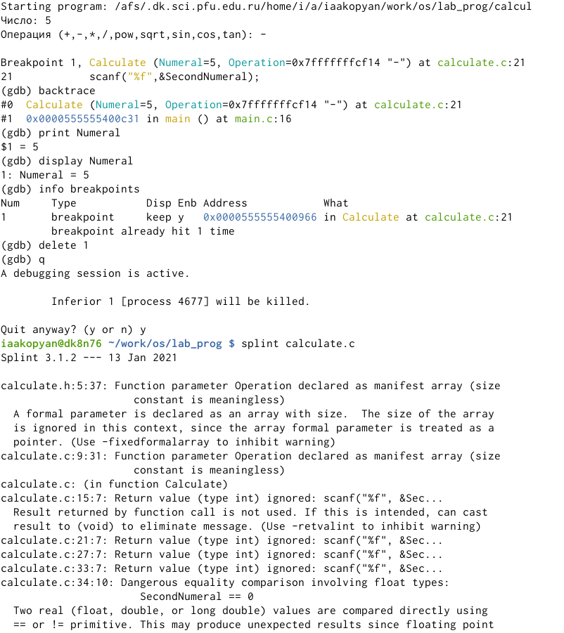
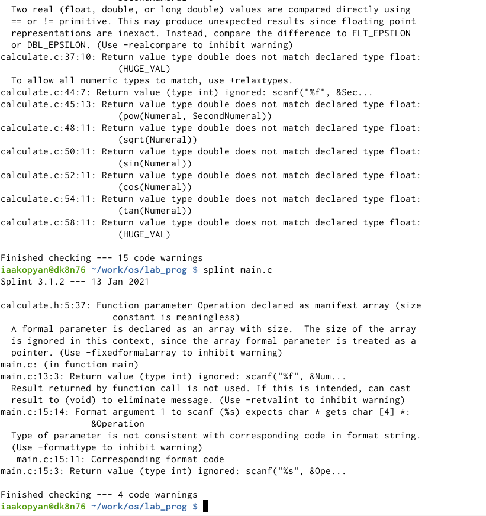

---
# Front matter
lang: ru-RU
title: "Лабораторная работа №14"
subtitle: "Средства, применяемые приразработке программного обеспечения в ОС типа UNIX/Linux."
author: "Акопян Изабелла Арменовна"

# Formatting
toc-title: "Содержание"
toc: true # Table of contents
toc_depth: 2
lof: true # List of figures
lot: true # List of tables
fontsize: 12pt
linestretch: 1.5
papersize: a4paper
documentclass: scrreprt
polyglossia-lang: russian
polyglossia-otherlangs: english
mainfont: PT Serif
romanfont: PT Serif
sansfont: PT Sans
monofont: PT Mono
mainfontoptions: Ligatures=TeX
romanfontoptions: Ligatures=TeX
sansfontoptions: Ligatures=TeX,Scale=MatchLowercase
monofontoptions: Scale=MatchLowercase
indent: true
pdf-engine: lualatex
header-includes:
  - \linepenalty=10 # the penalty added to the badness of each line within a paragraph (no associated penalty node) Increasing the value makes tex try to have fewer lines in the paragraph.
  - \interlinepenalty=0 # value of the penalty (node) added after each line of a paragraph.
  - \hyphenpenalty=50 # the penalty for line breaking at an automatically inserted hyphen
  - \exhyphenpenalty=50 # the penalty for line breaking at an explicit hyphen
  - \binoppenalty=700 # the penalty for breaking a line at a binary operator
  - \relpenalty=500 # the penalty for breaking a line at a relation
  - \clubpenalty=150 # extra penalty for breaking after first line of a paragraph
  - \widowpenalty=150 # extra penalty for breaking before last line of a paragraph
  - \displaywidowpenalty=50 # extra penalty for breaking before last line before a display math
  - \brokenpenalty=100 # extra penalty for page breaking after a hyphenated line
  - \predisplaypenalty=10000 # penalty for breaking before a display
  - \postdisplaypenalty=0 # penalty for breaking after a display
  - \floatingpenalty = 20000 # penalty for splitting an insertion (can only be split footnote in standard LaTeX)
  - \raggedbottom # or \flushbottom
  - \usepackage{float} # keep figures where there are in the text
  - \floatplacement{figure}{H} # keep figures where there are in the text
---

# Цель работы

Приобрести простейшие навыки разработки, анализа, тестирования и отладки приложений в ОС типа UNIX/Linux на примере создания на языке программирования С калькулятора с простейшими функциями.

# Задание

1. Создать каталог ~/work/os/lab_prog.

2. Создать в нём файлы: calculate.h, calculate.c, main.c.

3. Выполнить компиляцию.

4. Создать makefile.

5. Выполнить отладку программы calcul.

6. Проанализировать коды файлов calculate.c и main.c.

# Выполнение лабораторной работы

Ознакомилась с лабораторной работой №13 ([ссылка 1](https://esystem.rudn.ru/pluginfile.php/1142526/mod_resource/content/2/011-lab_prog.pdf)) и приступила к выполнению заданий.

В домашнем каталоге создала подкаталог ~/work/os/lab_prog. 

В каталоге создала файлы: calculate.h, calculate.c, main.c. Это нужно для примитивнейшего калькулятора, способного складывать, вычитать,умножать и делить, возводить число в степень, брать квадратный корень, вы-числять sin, cos, tan. При запуске он будет запрашивать первое число, операцию, второе число. После этого программа должна будет вывести результат и остановится.

Ниже показаны команды запуска редактора emacs (рис. -@fig:001).Там же и на (рис. -@fig:002) показана компиляция программ с помощью gcc (опция -c создает объектные файлы, -o задает имена файлам).

{ #fig:001 width=70% }

{ #fig:002 width=70% }

В файл main.c записала этот код (рис. -@fig:003):

{ #fig:003 width=70% }

В файл calculate.c записала этот (рис. -@fig:004):

{ #fig:004 width=70% }

Содержимое файла calculate.h (рис. -@fig:005): 

{ #fig:005 width=70% }

Создала Makefile (рис. -@fig:006): 

{ #fig:006 width=70% }

С помощью gdb выполнила отладку программы calcul (рис. -@fig:007). Чтобы запустить отладчик пишу 'gdb ./calcul'. Для запуска калькулятора внутри отладчика пишу 'run'. 

{ #fig:007 width=70% }

Чтобы просмотреть первые 10 строк кода пишу 'list'. Или же использую лист с параметрами. Для точки останова пишу 'break <номер строки>'. (рис. -@fig:008)

{ #fig:008 width=70% }

Запустила программу внутри отладчика, программа остановилась в момент прохождения точки останова (рис. -@fig:009).
Отладчик выдал следующую информацию:

>'#0  Calculate (Numeral=5, Operation=0x7fffffffcf14 "-")at calculate.c:21'

>'#1  0x0000000000400c31 in main () at main.c:16'

Я вызвала команду backtrace и смогла вывести весь стек вызываемых функций от начала программы до текущего места.

Посмотрела, чему равно на этом этапе значение переменной Numeral, введя:

>print Numeral

Было выведено число 5.

Сравнила с результатом вывода на экран после использования команды:

>display Numeral

Удалила точку останова (delete 1).

{ #fig:009 width=70% }

С помощью утилиты splint попробовала проанализировать коды файлов calculate.c и main.c (рис. -@fig:009) (рис. -@fig:010). Информацию о splint нашла здесь: [ссылка 2](http://espressocode.top/splint-c-program-verifier/)

Splint- это UNIX программа, позволяющая проводить статический анализ кода, написанного на Си. 

Splint особенно хорош при проверке проверки типов назначений переменных и функций, эффективности, неиспользуемых переменных и идентификаторов функций, недоступного кода и возможных утечек памяти.

{ #fig:010 width=70% }

# Выводы

Приобрела простейшие навыки разработки, анализа, тестирования и отладки приложений в ОС типа UNIX/Linux на примере создания на языке программирования С калькулятора с простейшими функциями.

# Библиография

[ссылка 1](https://esystem.rudn.ru/pluginfile.php/1142526/mod_resource/content/2/011-lab_prog.pdf)

[ссылка 2](http://espressocode.top/splint-c-program-verifier/)
