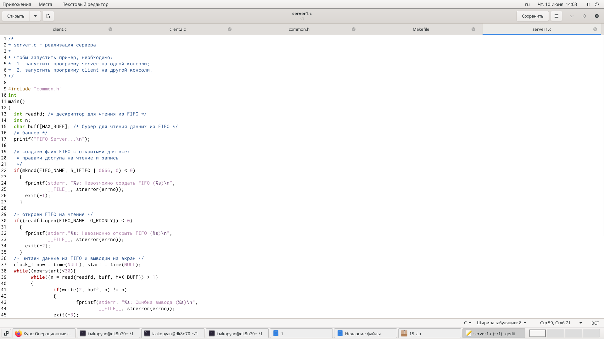
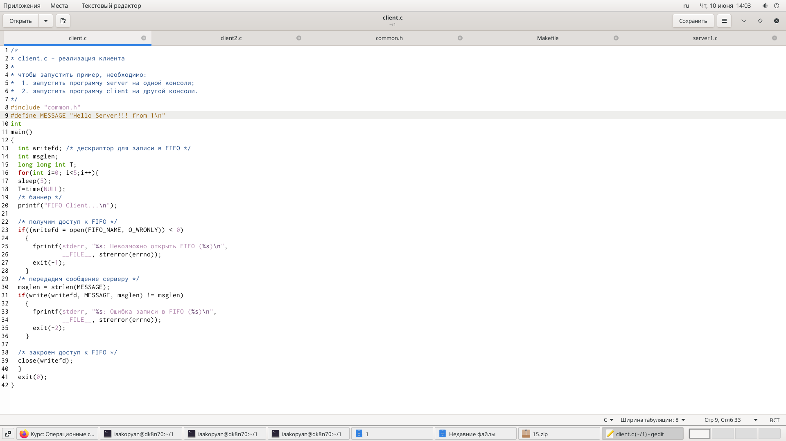
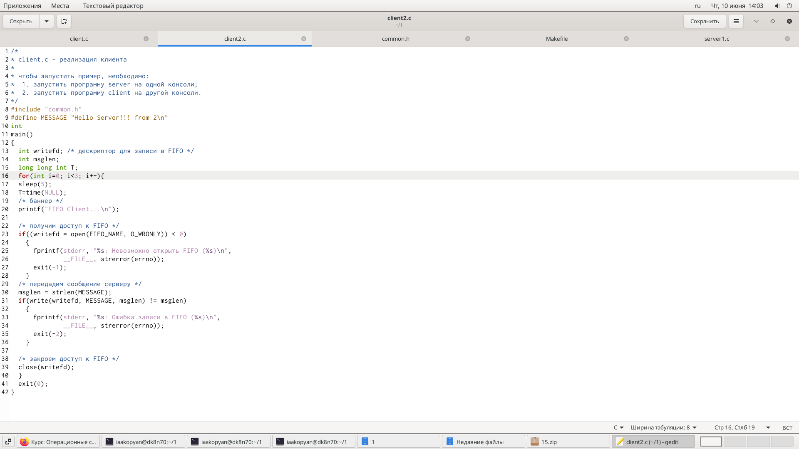
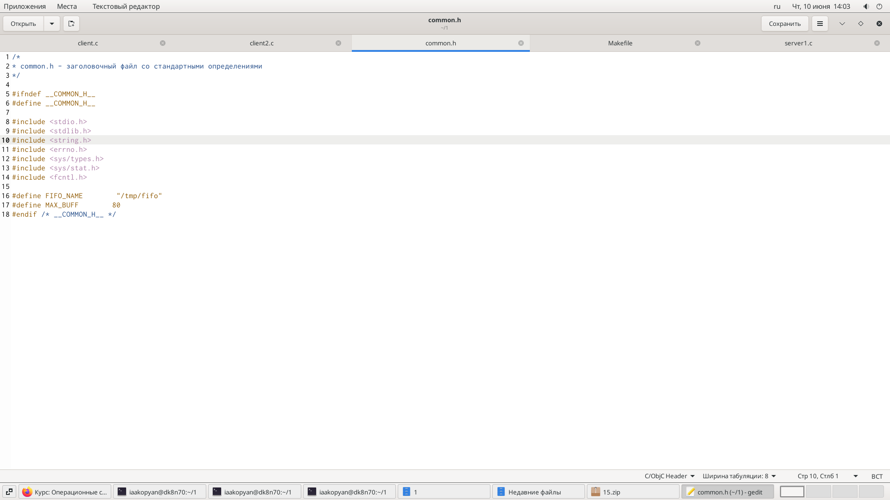
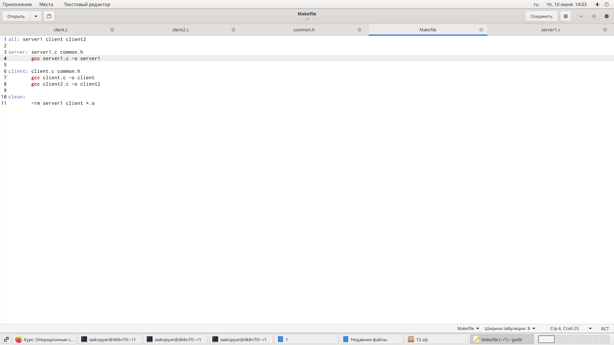
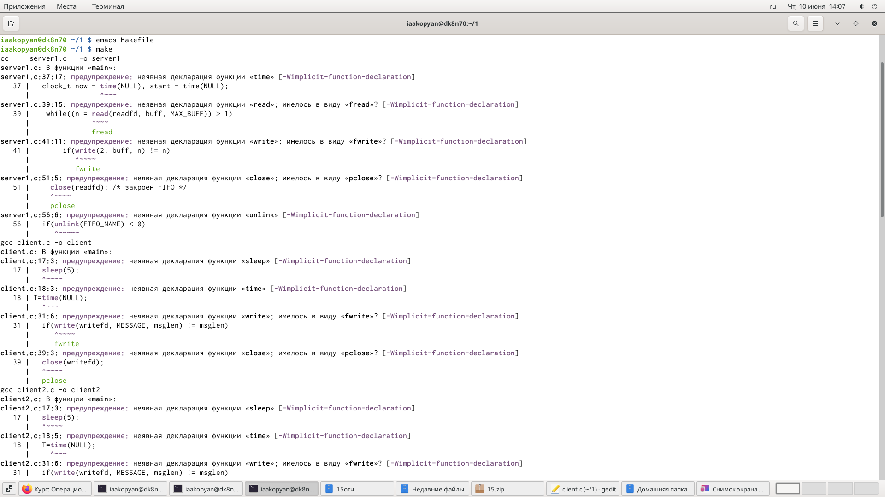
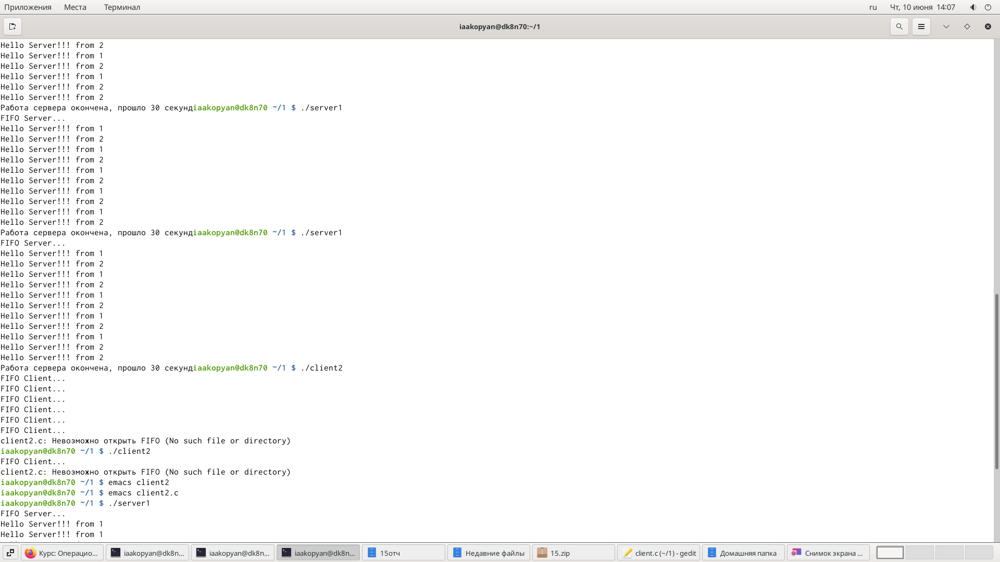
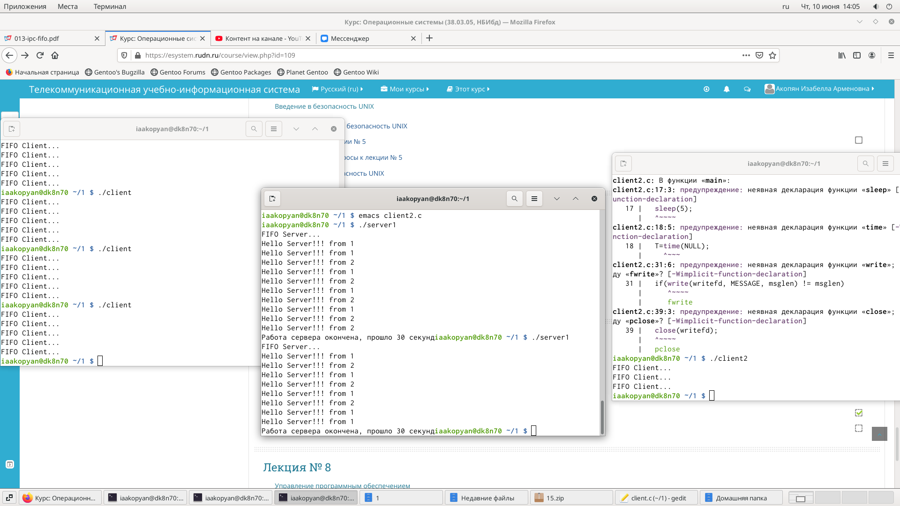

---
# Front matter
lang: ru-RU
title: "Отчет по лабораторной работе №15"
subtitle: "Именованные каналы."
author: "Акопян Изабелла Арменовна"

# Formatting
toc-title: "Содержание"
toc: true # Table of contents
toc_depth: 2
lof: true # List of figures
lot: true # List of tables
fontsize: 12pt
linestretch: 1.5
papersize: a4paper
documentclass: scrreprt
polyglossia-lang: russian
polyglossia-otherlangs: english
mainfont: PT Serif
romanfont: PT Serif
sansfont: PT Sans
monofont: PT Mono
mainfontoptions: Ligatures=TeX
romanfontoptions: Ligatures=TeX
sansfontoptions: Ligatures=TeX,Scale=MatchLowercase
monofontoptions: Scale=MatchLowercase
indent: true
pdf-engine: lualatex
header-includes:
  - \linepenalty=10 # the penalty added to the badness of each line within a paragraph (no associated penalty node) Increasing the value makes tex try to have fewer lines in the paragraph.
  - \interlinepenalty=0 # value of the penalty (node) added after each line of a paragraph.
  - \hyphenpenalty=50 # the penalty for line breaking at an automatically inserted hyphen
  - \exhyphenpenalty=50 # the penalty for line breaking at an explicit hyphen
  - \binoppenalty=700 # the penalty for breaking a line at a binary operator
  - \relpenalty=500 # the penalty for breaking a line at a relation
  - \clubpenalty=150 # extra penalty for breaking after first line of a paragraph
  - \widowpenalty=150 # extra penalty for breaking before last line of a paragraph
  - \displaywidowpenalty=50 # extra penalty for breaking before last line before a display math
  - \brokenpenalty=100 # extra penalty for page breaking after a hyphenated line
  - \predisplaypenalty=10000 # penalty for breaking before a display
  - \postdisplaypenalty=0 # penalty for breaking after a display
  - \floatingpenalty = 20000 # penalty for splitting an insertion (can only be split footnote in standard LaTeX)
  - \raggedbottom # or \flushbottom
  - \usepackage{float} # keep figures where there are in the text
  - \floatplacement{figure}{H} # keep figures where there are in the text
---

# Цель

Приобретение практических навыков работы с именованными каналами.

# Задание

Изучите приведённые в тексте программы server.c и client.c. Взяв данные примеры за образец, напишите аналогичные программы, внеся следующие изменения:

1. Работает не 1 клиент, а несколько (например, два).

2. Клиенты передают текущее время с некоторой периодичностью (например, раз в пять секунд). Используйте функцию sleep() для приостановки работы клиента.

3. Сервер работает не бесконечно, а прекращает работу через некоторое время (например, 30 сек). Используйте функцию clock() для определения времени работы сервера.

# Выполнение лабораторной работы

Работаю по материалам лабораторной работы №15:

>[Ссылка1](https://esystem.rudn.ru/pluginfile.php/1142529/mod_resource/content/1/013-ipc-fifo.pdf)

Далее мне пришлось сначала ознакомиться с дополнительными материалами про FIFO:

>[Ссылка2](https://it.wikireading.ru/6594)

Написала файлы, которые нужны для работы будущей программы. Файл server1.c: (рис. -@fig:001) Файл client.c: (рис. -@fig:002) Файл client2.c: (рис. -@fig:003) Файл common.h: (рис. -@fig:004) Файл Makefile: (рис. -@fig:005)

{ #fig:001 width=80% }

{ #fig:002 width=80% }

{ #fig:003 width=80% }

{ #fig:004 width=80% }

{ #fig:005 width=80% }

Потом скомпилировала файлы используя Makefile и команду make (рис. -@fig:006): 

{ #fig:006 width=80% }

Вышло много предупреждений, но это не мешает дальнейшей работе. Главное нет ошибок.

Здесь показано завершение работы сервера, но при этом клиент не успел провести всю работу. Вышло предупреждение: (рис. -@fig:007)

{ #fig:007 width=80% }

Если бы я прекратила работу сервера принудительно с помощью Ctrl+C, то я не могла бы в дальнейшнем запустить программу еще раз. Мне пришлось бы искать файл fifo и удалять его вручную.

**Итог**

Ниже показана работа программы в целом (рис. -@fig:008):

{ #fig:008 width=80% }

# Вывод

Я успешно приобрела практические навыки работы с именованными каналами.

# Библиография

>[Ссылка1](https://esystem.rudn.ru/pluginfile.php/1142529/mod_resource/content/1/013-ipc-fifo.pdf)

>[Ссылка2](https://it.wikireading.ru/6594)
