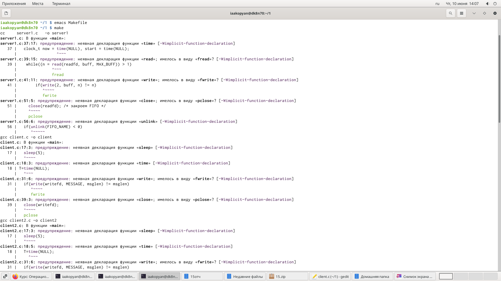

---
## Front matter
lang: ru-RU
title: Лабораторная работа 15
author: |
	Акопян Изабелла Арменовна\inst{}
institute: |
	\inst{}RUDN University, Moscow, Russian Federation

date: 2021, 11 Июня

## Formatting
toc: false
slide_level: 2
theme: metropolis
header-includes: 
 - \metroset{progressbar=frametitle,sectionpage=progressbar,numbering=fraction}
 - '\makeatletter'
 - '\beamer@ignorenonframefalse'
 - '\makeatother'
aspectratio: 43
section-titles: true
---

# Именованные каналы.

## Цель

- Приобретение практических навыков работы с именованными каналами.

## Задачи

Изучить приведённые в тексте программы server.c и client.c. Взяв данные примеры за образец, написать аналогичные программы, внеся следующие изменения:

1. Работает не 1 клиент, а несколько (например, два).

2. Клиенты передают текущее время с некоторой периодичностью (например, раз в пять секунд). Используйте функцию sleep() для приостановки работы клиента.

3. Сервер работает не бесконечно, а прекращает работу через некоторое время (например, 30 сек). Используйте функцию clock() для определения времени работы сервера.

## Выполнение лабораторной работы (1/4)

{ #fig:002 width=80% }
{ #fig:003 width=80% }

## (2/4)

{ #fig:001 width=80% }
{ #fig:004 width=80% }

## (3/4)

{ #fig:005 width=80% }
{ #fig:006 width=80% }

## (4/4) 

{ #fig:008 width=80% }

## Выводы

- Я успешно приобрела практические навыки работы с именованными каналами.

## Библиография

>[Ссылка1](https://esystem.rudn.ru/pluginfile.php/1142529/mod_resource/content/1/013-ipc-fifo.pdf)

>[Ссылка2](https://it.wikireading.ru/6594)
