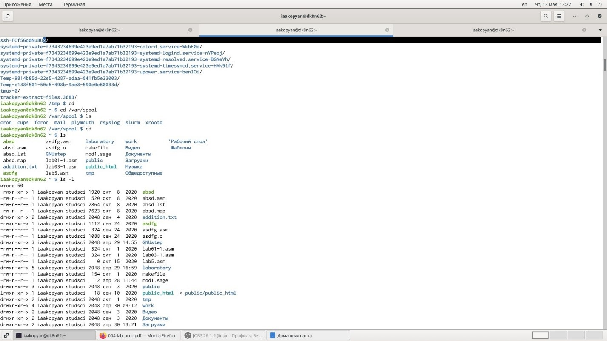

---
# Front matter
lang: ru-RU
title: "Отчет по лабораторной работе №5"
subtitle: "Основы интерфейса взаимодействия пользователя с системой Unix на уровне командной строки"
author: "Акопян Изабелла Арменовна"

# Formatting
toc-title: "Содержание"
toc: true # Table of contents
toc_depth: 2
lof: true # List of figures
lot: true # List of tables
fontsize: 12pt
linestretch: 1.5
papersize: a4paper
documentclass: scrreprt
polyglossia-lang: russian
polyglossia-otherlangs: english
mainfont: PT Serif
romanfont: PT Serif
sansfont: PT Sans
monofont: PT Mono
mainfontoptions: Ligatures=TeX
romanfontoptions: Ligatures=TeX
sansfontoptions: Ligatures=TeX,Scale=MatchLowercase
monofontoptions: Scale=MatchLowercase
indent: true
pdf-engine: lualatex
header-includes:
  - \linepenalty=10 # the penalty added to the badness of each line within a paragraph (no associated penalty node) Increasing the value makes tex try to have fewer lines in the paragraph.
  - \interlinepenalty=0 # value of the penalty (node) added after each line of a paragraph.
  - \hyphenpenalty=50 # the penalty for line breaking at an automatically inserted hyphen
  - \exhyphenpenalty=50 # the penalty for line breaking at an explicit hyphen
  - \binoppenalty=700 # the penalty for breaking a line at a binary operator
  - \relpenalty=500 # the penalty for breaking a line at a relation
  - \clubpenalty=150 # extra penalty for breaking after first line of a paragraph
  - \widowpenalty=150 # extra penalty for breaking before last line of a paragraph
  - \displaywidowpenalty=50 # extra penalty for breaking before last line before a display math
  - \brokenpenalty=100 # extra penalty for page breaking after a hyphenated line
  - \predisplaypenalty=10000 # penalty for breaking before a display
  - \postdisplaypenalty=0 # penalty for breaking after a display
  - \floatingpenalty = 20000 # penalty for splitting an insertion (can only be split footnote in standard LaTeX)
  - \raggedbottom # or \flushbottom
  - \usepackage{float} # keep figures where there are in the text
  - \floatplacement{figure}{H} # keep figures where there are in the text
---

# Цель работы

Приобретение практических навыков взаимодействия пользователя с системой посредством командной строки.

# Задание

- Определить полное имя домашнего каталога. 
- Выполнить заданные переходы между каталогами.
- Просмотреть содержимое каталогов, используя ls с различными опциями.
- Создать каталоги и подкаталоги и некоторые удалить.
- Выполнить команду man с различными опциями.
- Использовать команду history.

# Выполнение лабораторной работы

Определила полное имя своего домашнего каталога.  Перешла в каталог /tmp и вывела его содержимое сначала без всяких опций. Потом с опцией -a (отображает имена скрытых файлов, перед ними стоит точка).

{ #fig:001 width=70% }

потом с -l (выводит подробный список, в котором будет отображаться владелец, группа, дата создания, размер и т.д.), потом с -F (дает информацию о типах фалов).

{ #fig:001 width=70% }

Перешла в каталог /var/spool. Вывела его содержимое командой ls. Нашла там ‘cron’. Далее перешла в домашний каталог и командой ls -l определяю владельца файлов и каталогов.

{ #fig:001 width=70% }

В домашнем каталоге создала каталог ~/newdir. В нем создала morefun. 

Потом в домашнем каталоге создала одной командой letters, memos и misk. 

Одной командой и удалила их. 

Далее попробовала удалить каталог ~/newdir командой ‘rmdir’, yичего не вышло, т.к. ‘каталог не пуст’ b даже если удалять просто командой ‘rm’ выводится ‘is a directory’. 

Потом попробовала удалить каталог ~/newdir/morefun командой ‘rm -r’ (обычно для каталогов с файлами). Удалилось.

Далее работала с командой ‘man …’.

Определила , что для просмотра содержимого не только указанного каталога, но и подкаталогов, входящих в него с ls используем опцию -R.

Набор опций команды ls, позволяющий отсортировать по времени последнего изменения выводимый список содержимого каталога с развёрнутым описанием файлов – l и -t.

{ #fig:001 width=70% }

Использовала команду history. Выполнила модификацию 504-й команды. И исполнила ее и 509-ю с 526-й командой.

{ #fig:001 width=70% }

{ #fig:001 width=70% }

{ #fig:001 width=70% }

**Справки**

{ #fig:001 width=70% }

{ #fig:001 width=70% }

{ #fig:001 width=70% }

{ #fig:001 width=70% }

{ #fig:001 width=70% }

{ #fig:001 width=70% }

# Выводы

Я успешно приобрела практические навыки взаимодействия пользователя с системой посредством командной строки.
