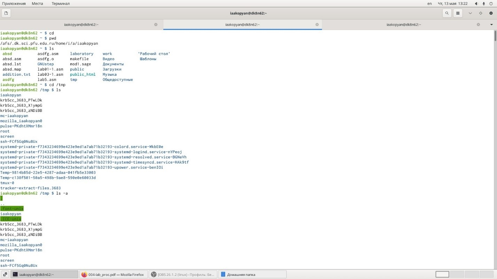
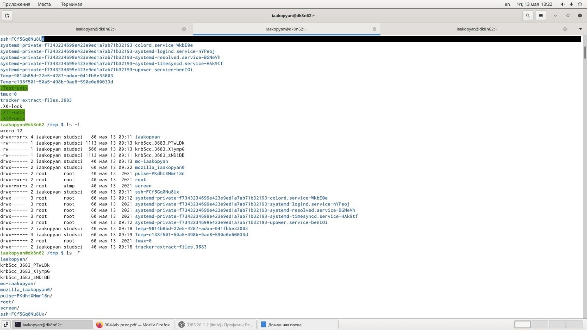
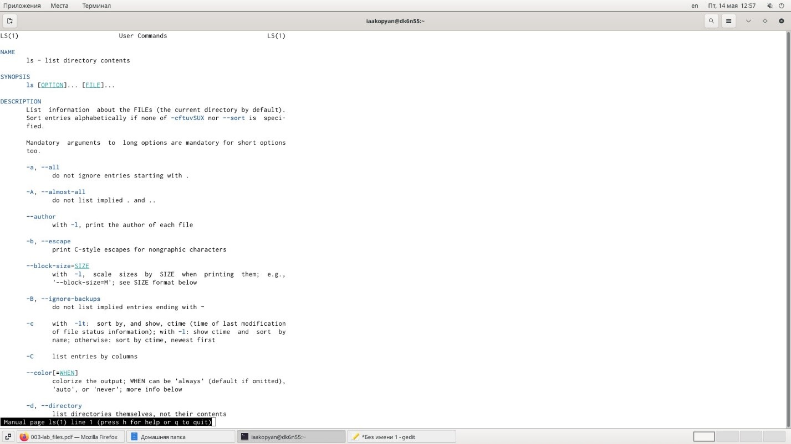
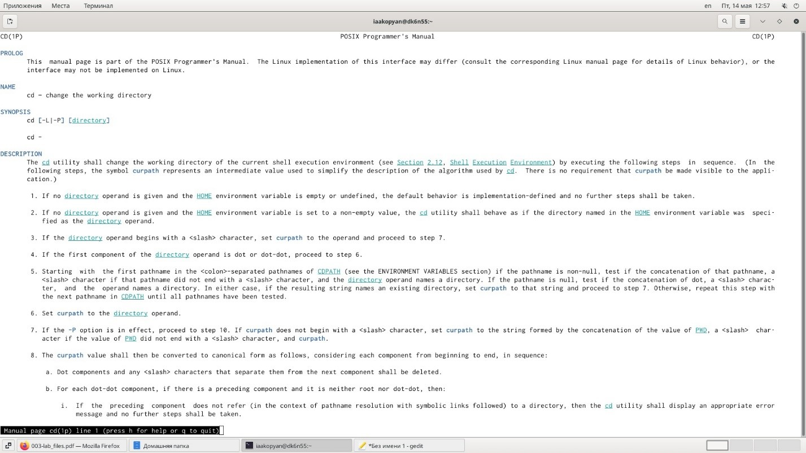
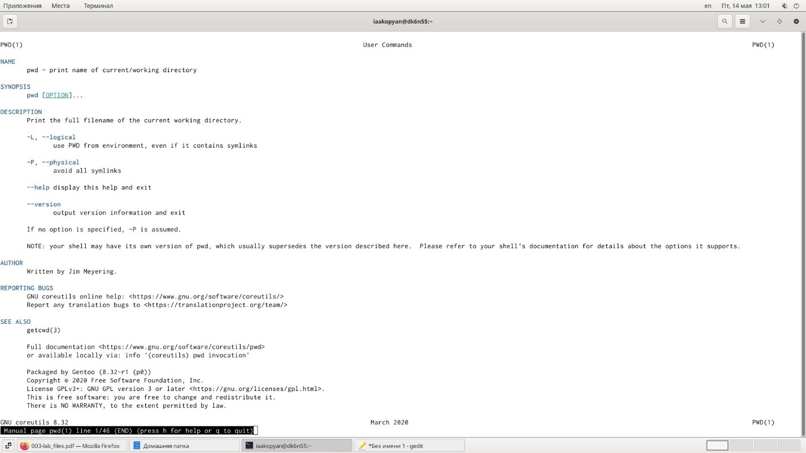
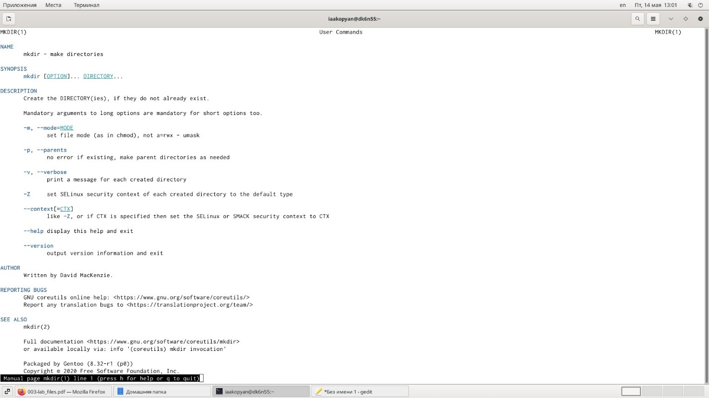
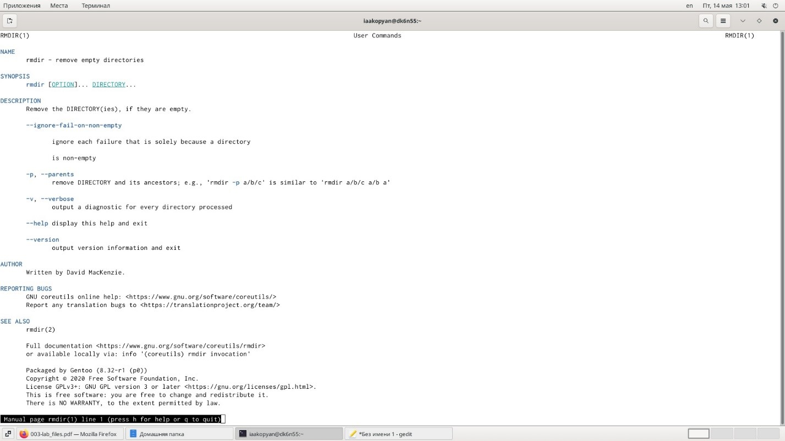
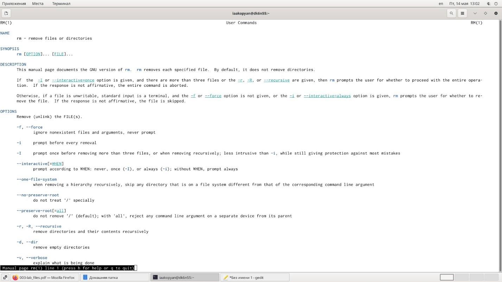

---
## Front matter
lang: ru-RU
title: Лабораторая работа 5

author: |
	Акопян Изабелла Арменовна\inst{}

institute: |
	\inst{}RUDN University, Moscow, Russian Federation

date: 2021, 15 Мая

## Formatting
toc: false
slide_level: 2
theme: metropolis
header-includes: 
 - \metroset{progressbar=frametitle,sectionpage=progressbar,numbering=fraction}
 - '\makeatletter'
 - '\beamer@ignorenonframefalse'
 - '\makeatother'
aspectratio: 43
section-titles: true
---

# Основы интерфейса взаимодействия пользователя с системой Unix на уровне командной строки.

## Цель лабораторной работы

Приобретение практических навыков взаимодействия пользователя с системой посредством командной строки.

## Задачи

- Определить полное имя домашнего каталога. 
- Выполнить заданные переходы между каталогами. 
- Просмотреть содержимое каталогов, используя ls с различными опциями. 
- Создать каталоги и подкаталоги и некоторые удалить. 
- Выполнить команду man с различными опциями. 
- Использовать команду history.

## Начало работы

{ #fig:001 width=70% }
{ #fig:001 width=70% }

## Полученные справки (1/3)

{ #fig:001 width=70% }
{ #fig:001 width=70% }

## Полученные справки (2/3)

{ #fig:001 width=70% }
{ #fig:001 width=70% }

## Полученные справки (3/3)

{ #fig:001 width=70% }
{ #fig:001 width=70% }

## Вывод

Я успешно приобрела практические навыки взаимодействия пользователя с системой посредством командной строки.

