---
# Front matter
lang: ru-RU
title: "Отчет по лабораторной работе 6"
subtitle: "Анализ файловой системы Linux. Команды для работы с файлами и каталогами"
author: "Акопян Изабелла Арменовна"

# Formatting
toc-title: "Содержание"
toc: true # Table of contents
toc_depth: 2
lof: true # List of figures
lot: true # List of tables
fontsize: 12pt
linestretch: 1.5
papersize: a4paper
documentclass: scrreprt
polyglossia-lang: russian
polyglossia-otherlangs: english
mainfont: PT Serif
romanfont: PT Serif
sansfont: PT Sans
monofont: PT Mono
mainfontoptions: Ligatures=TeX
romanfontoptions: Ligatures=TeX
sansfontoptions: Ligatures=TeX,Scale=MatchLowercase
monofontoptions: Scale=MatchLowercase
indent: true
pdf-engine: lualatex
header-includes:
  - \linepenalty=10 # the penalty added to the badness of each line within a paragraph (no associated penalty node) Increasing the value makes tex try to have fewer lines in the paragraph.
  - \interlinepenalty=0 # value of the penalty (node) added after each line of a paragraph.
  - \hyphenpenalty=50 # the penalty for line breaking at an automatically inserted hyphen
  - \exhyphenpenalty=50 # the penalty for line breaking at an explicit hyphen
  - \binoppenalty=700 # the penalty for breaking a line at a binary operator
  - \relpenalty=500 # the penalty for breaking a line at a relation
  - \clubpenalty=150 # extra penalty for breaking after first line of a paragraph
  - \widowpenalty=150 # extra penalty for breaking before last line of a paragraph
  - \displaywidowpenalty=50 # extra penalty for breaking before last line before a display math
  - \brokenpenalty=100 # extra penalty for page breaking after a hyphenated line
  - \predisplaypenalty=10000 # penalty for breaking before a display
  - \postdisplaypenalty=0 # penalty for breaking after a display
  - \floatingpenalty = 20000 # penalty for splitting an insertion (can only be split footnote in standard LaTeX)
  - \raggedbottom # or \flushbottom
  - \usepackage{float} # keep figures where there are in the text
  - \floatplacement{figure}{H} # keep figures where there are in the text
---

# Цель работы

Ознакомление с файловой системой Linux, её структурой, именами и содержанием каталогов. Приобретение практических навыков по применению команд для работы с файлами и каталогами, по управлению процессами (и работами), по проверке использования диска и обслуживанию файловой системы. 

# Задание

- Выполнить все примеры из первой части
- Копирование заданных файлов в каталоги
- Создание директорий и каталогов
- Перемещение файлов
- Переименование файлов
- Изменение прав доступа к файлам
- Просмотр содержимого файлов
- Работа со справкой man

# Выполнение лабораторной работы

Выполнила примеры из первой части.

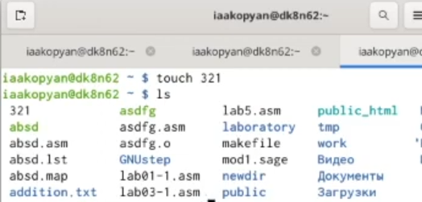{ #fig:001 width=70% }

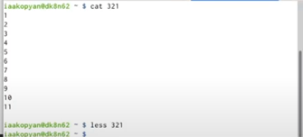{ #fig:001 width=70% }

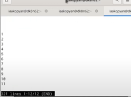{ #fig:001 width=70% }

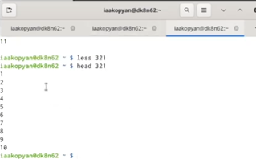{ #fig:001 width=70% }

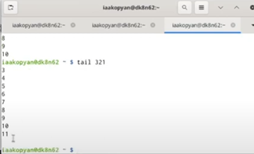{ #fig:001 width=70% }

Скопировала файл /usr/include/sys/io.h в домашний каталог и назвала его equipment.

Создала директорию ski.plases. Переместила в этот каталог файл equipment.

Переименовала файл в equiplist.

Создала в домашнем каталоге файл abc1, скопировала его в ski.plases, назвала его ‘equiplist2’.

В каталоге ski.plases создала каталог equipment.

Переместила файлы equiplist и equiplist2 в каталог equipment.

Создала каталог newdir и переименовала его в каталоге ski.plases в ‘plans’.

Определила опции команды chmod. Создала нужные файлы.

Присвоила файлу australia права: drwxr—r—

Файлу play: drwx—x—x

Файлу my_os: -r-xr—r—

Файлу feathers: -rw-rw-r— 

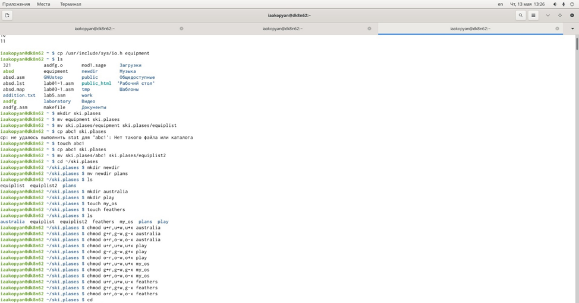{ #fig:001 width=70% }

Просмотрела содержимое файла /etc/passwd (/etc/password не было)

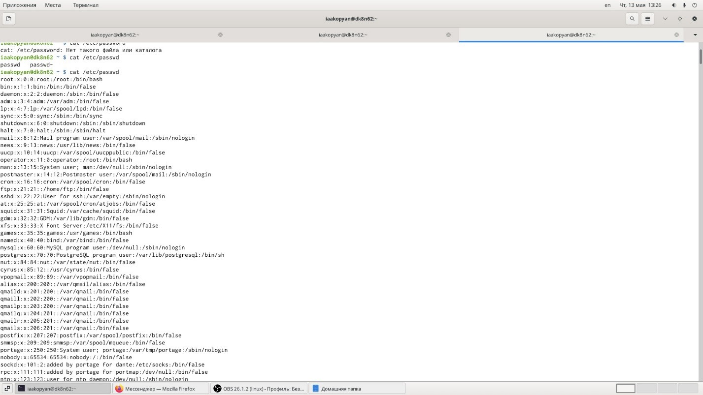{ #fig:001 width=70% }

Скопировала файл feathers в файл file.old.

Переместила файл file.old в каталог play.

Скопировала каталог play в каталог fun. 

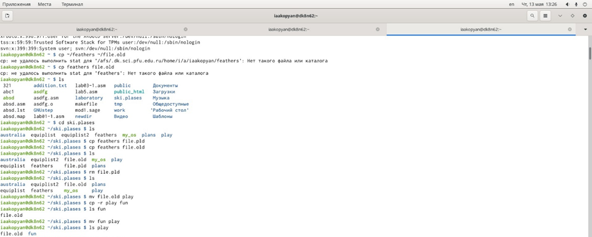{ #fig:001 width=70% }

Переместила каталог fun в каталог play и назвала его ‘games’.

Лишила владельца файла feathers права на чтение. Попыталась просмотреть этот файл, ничего не вышло. Скопировать тоже не получилось. Вернула владельцу право на чтение.

Лишила владельца каталога play права на выполнение. Все же перейти в каталог я смогла. Права вернула.

Прочитала man по командам mount, fsck, mkfs, kill. 

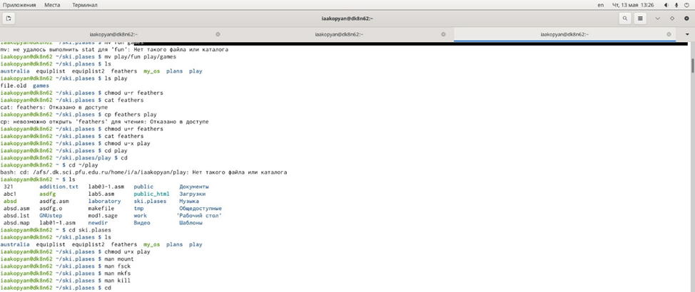{ #fig:001 width=70% }

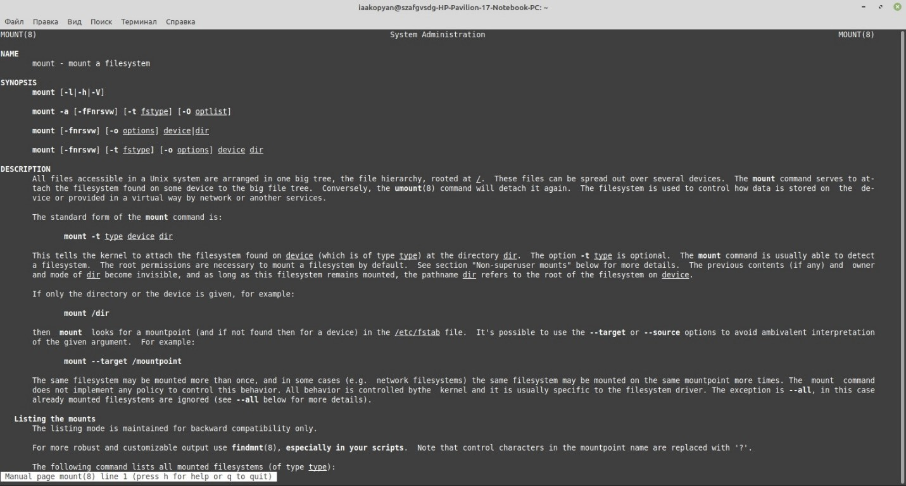{ #fig:001 width=70% }

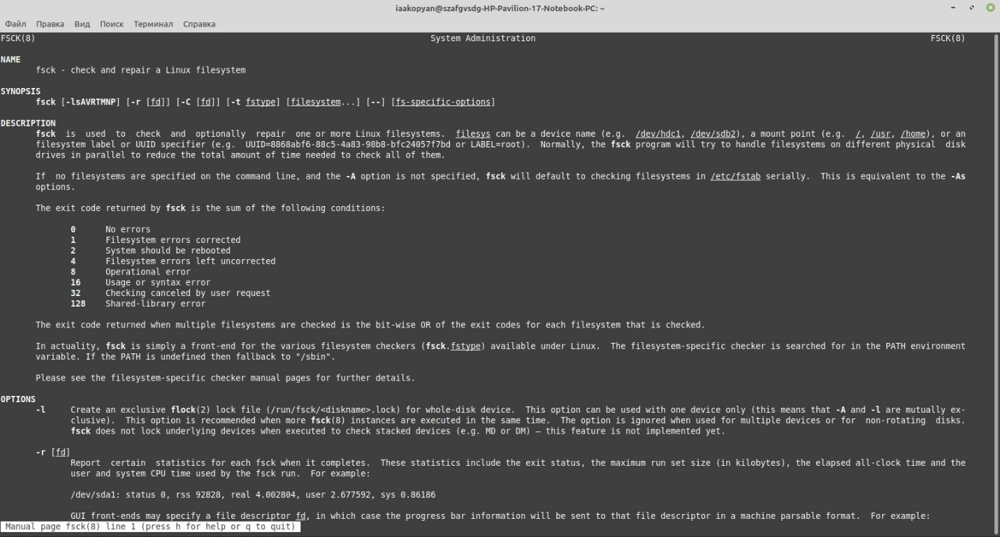{ #fig:001 width=70% }

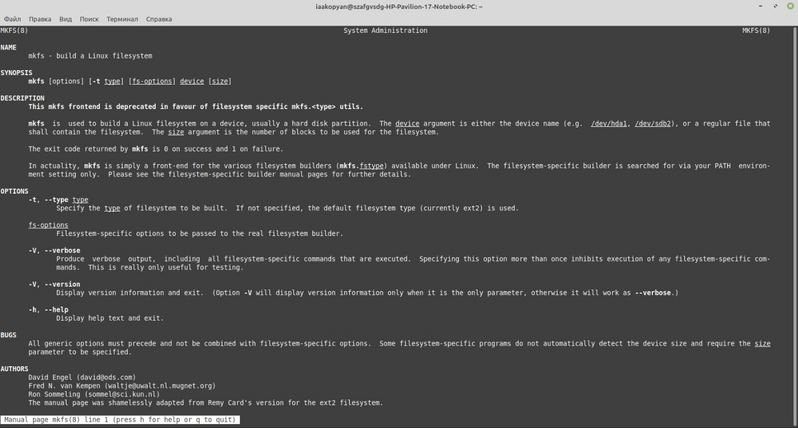{ #fig:001 width=70% }

{ #fig:001 width=70% }

# Вывод

Я удачно ознакомилась с файловой системой Linux, её структурой, именами и содержанием каталогов.

Приобрела практические навыки по применению команд для работы с файлами и каталогами, по управлению процессами (и работами), по проверке использования диска и обслуживанию файловой системы. 
