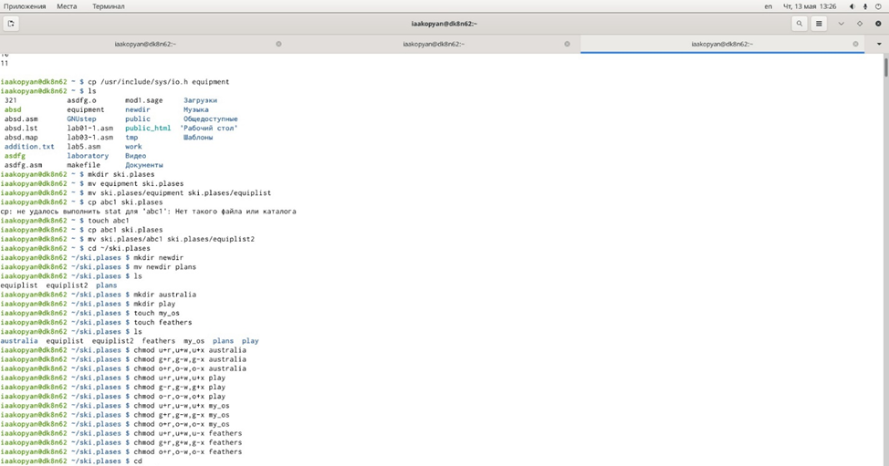
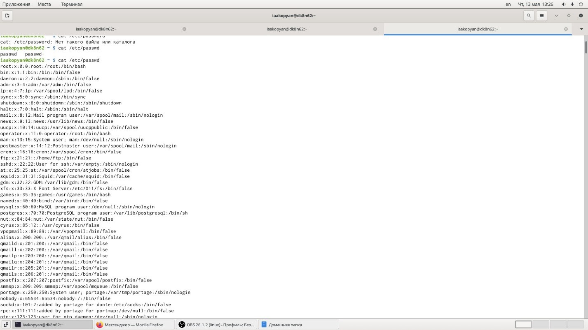
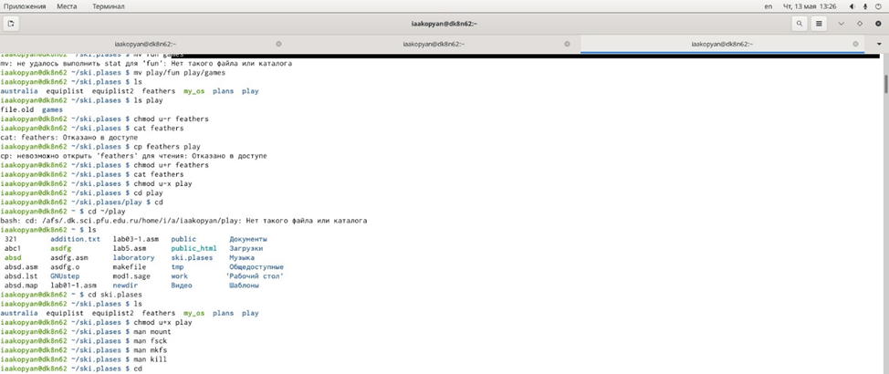
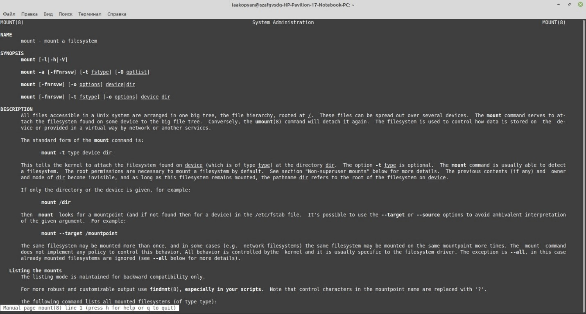
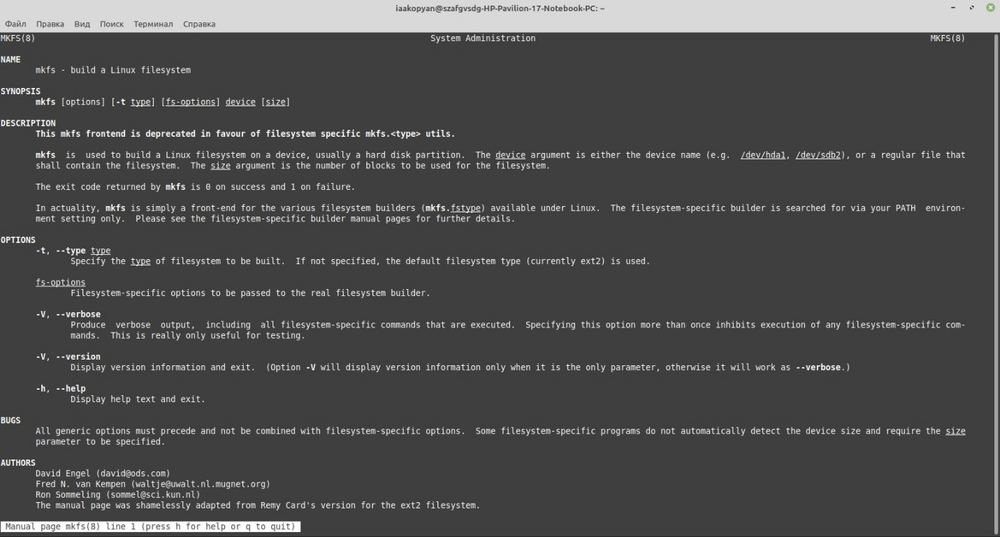

---
## Front matter
lang: ru-RU
title: Лабораторая работа 6

author: |
	Акопян Изабелла Арменовна\inst{}

institute: |
	\inst{}RUDN University, Moscow, Russian Federation

date: 2021, 15 Мая

## Formatting
toc: false
slide_level: 2
theme: metropolis
header-includes: 
 - \metroset{progressbar=frametitle,sectionpage=progressbar,numbering=fraction}
 - '\makeatletter'
 - '\beamer@ignorenonframefalse'
 - '\makeatother'
aspectratio: 43
section-titles: true
---

# Анализ файловой системы Linux. Команды для работы с файлами и каталогами.

## Цель лабораторной работы

Ознакомление с файловой системой Linux, её структурой, именами и содержанием каталогов. 
Приобретение практических навыков по применению команд для работы с файлами и каталогами, по управлению процессами (и работами), по проверке использования диска и обслуживанию файловой системы.

## Задачи

- Выполнить все примеры из первой части
- Копирование заданных файлов в каталоги
- Создание директорий и каталогов
- Перемещение файлов
- Переименование файлов
- Изменение прав доступа к файлам
- Просмотр содержимого файлов
- Работа со справкой man

## Основная работа

{ #fig:001 width=70% }
{ #fig:001 width=70% }

{ #fig:001 width=70% }
{ #fig:001 width=70% }

## Полученные справки (1/2)

{ #fig:001 width=70% }
{ #fig:001 width=70% }

## Полученные справки (2/2)

{ #fig:001 width=70% }
{ #fig:001 width=70% }

## Вывод

Я удачно ознакомилась с файловой системой Linux, её структурой, именами и содержанием каталогов. 
Приобрела практические навыки по применению команд для работы с файлами и каталогами, по управлению процессами (и работами), по проверке использования диска и обслуживанию файловой системы.

