---
# Front matter
lang: ru-RU
title: "Отчет по лабораторной работе 7"
subtitle: "Поиск файлов. Перенаправление ввода-вывода. Просмотр запущенных процессов"
author: "Акопян Изабелла Арменовна"

# Formatting
toc-title: "Содержание"
toc: true # Table of contents
toc_depth: 2
lof: true # List of figures
lot: true # List of tables
fontsize: 12pt
linestretch: 1.5
papersize: a4paper
documentclass: scrreprt
polyglossia-lang: russian
polyglossia-otherlangs: english
mainfont: PT Serif
romanfont: PT Serif
sansfont: PT Sans
monofont: PT Mono
mainfontoptions: Ligatures=TeX
romanfontoptions: Ligatures=TeX
sansfontoptions: Ligatures=TeX,Scale=MatchLowercase
monofontoptions: Scale=MatchLowercase
indent: true
pdf-engine: lualatex
header-includes:
  - \linepenalty=10 # the penalty added to the badness of each line within a paragraph (no associated penalty node) Increasing the value makes tex try to have fewer lines in the paragraph.
  - \interlinepenalty=0 # value of the penalty (node) added after each line of a paragraph.
  - \hyphenpenalty=50 # the penalty for line breaking at an automatically inserted hyphen
  - \exhyphenpenalty=50 # the penalty for line breaking at an explicit hyphen
  - \binoppenalty=700 # the penalty for breaking a line at a binary operator
  - \relpenalty=500 # the penalty for breaking a line at a relation
  - \clubpenalty=150 # extra penalty for breaking after first line of a paragraph
  - \widowpenalty=150 # extra penalty for breaking before last line of a paragraph
  - \displaywidowpenalty=50 # extra penalty for breaking before last line before a display math
  - \brokenpenalty=100 # extra penalty for page breaking after a hyphenated line
  - \predisplaypenalty=10000 # penalty for breaking before a display
  - \postdisplaypenalty=0 # penalty for breaking after a display
  - \floatingpenalty = 20000 # penalty for splitting an insertion (can only be split footnote in standard LaTeX)
  - \raggedbottom # or \flushbottom
  - \usepackage{float} # keep figures where there are in the text
  - \floatplacement{figure}{H} # keep figures where there are in the text
---

# Цель работы

Ознакомление с инструментами поиска файлов и фильтрации текстовых данных. Приобретение практических навыков: по управлению процессами (и заданиями), по проверке использования диска и обслуживанию файловых систем.

# Задание

- Запись в файл названия файлов в каталоге
- Добаление в файл названий файлов в каталоге
- Вывод имён файлов с определенным расширением и запись их в другой файл
- Определение файлов, название которых начинается с определенной буквы
- Запуск процессов в фоновом режиме
- Чтение необходимых справок
- Определение идентификаторов процесса gedit
- Выволнение команд df и du
- Вывод имен всех директорий

# Выполнение лабораторной работы

Осуществила вход в систему.

Записала в файл file.txt названия файлов, содержащихся в каталоге /etc. Дописала в этот файл названия файлов, содержащихся в моем домашнем каталоге. Просмотрела содержимое файла file.txt. 

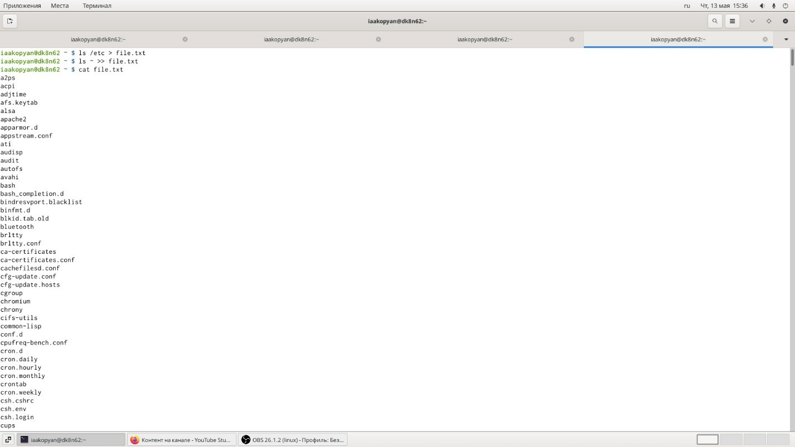{ #fig:001 width=70% }

Записала имена всех файлов из file.txt с расширением .conf в текстовый файл conf.txt. И вывела содержимое файла conf.txt.

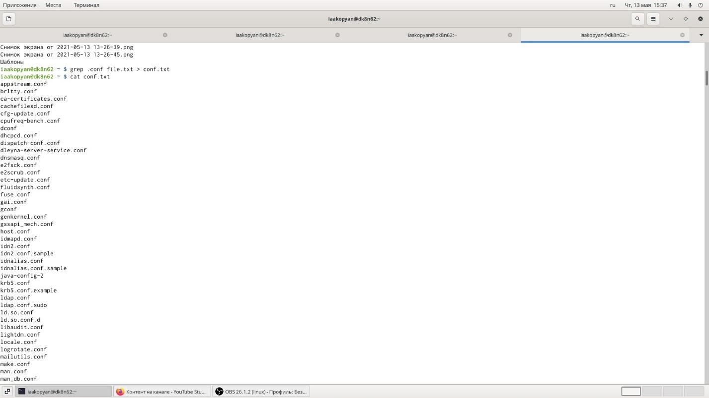{ #fig:001 width=70% }

Определила какие файлы в домашнем каталоге имеют имена, начинавшиеся с символа ‘c’ с помощью команды find ~ -name ‘c*’ -print, ls c* и ls -l |grep c*.

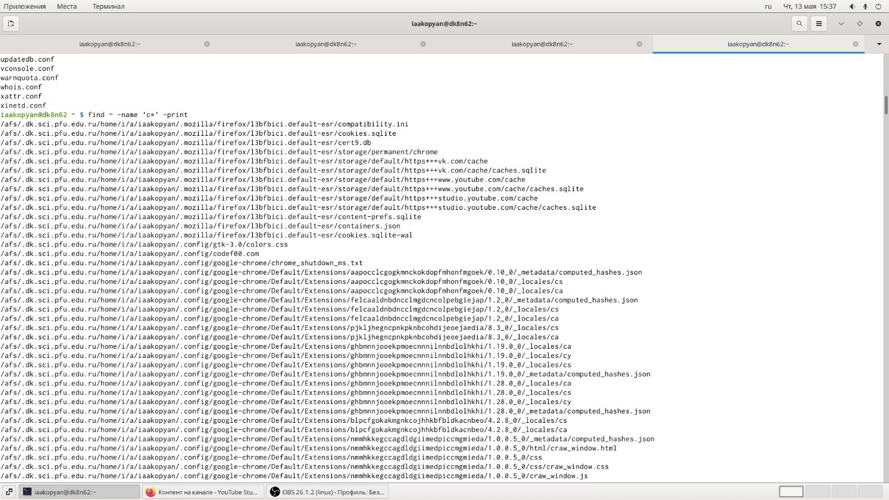{ #fig:001 width=70% }

Вывела на экран имена файлов из каталога /etc, начинающиеся с символа ‘h’.

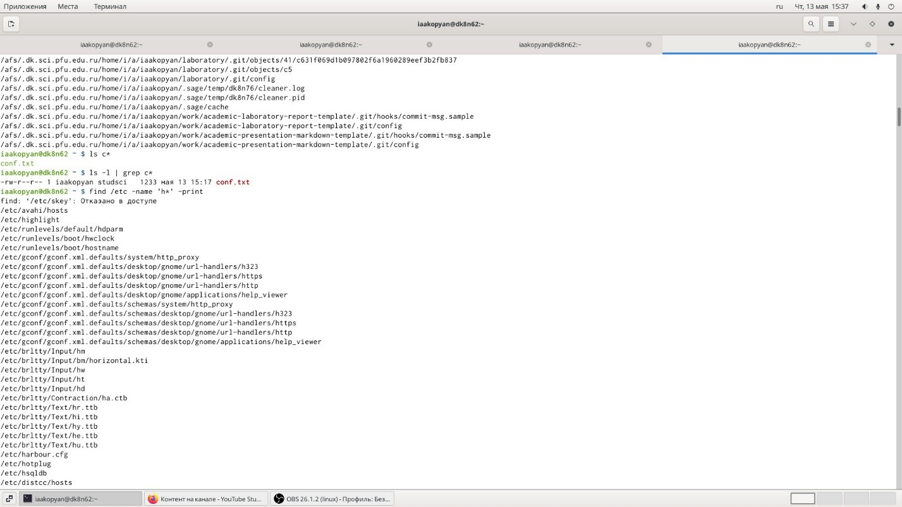{ #fig:001 width=70% }

Запустила в фоновом режиме процесс, который будет записывать в файл logfile файлы, имена которых начинаются с log. Удалила файл logfile и процесс завершился.

Запустила из консоли в фоновом режиме редактор gedit. Определила идентификатор процесса gedit с помощью ps (простой способ), ps aux, ps aux | grep gedit.

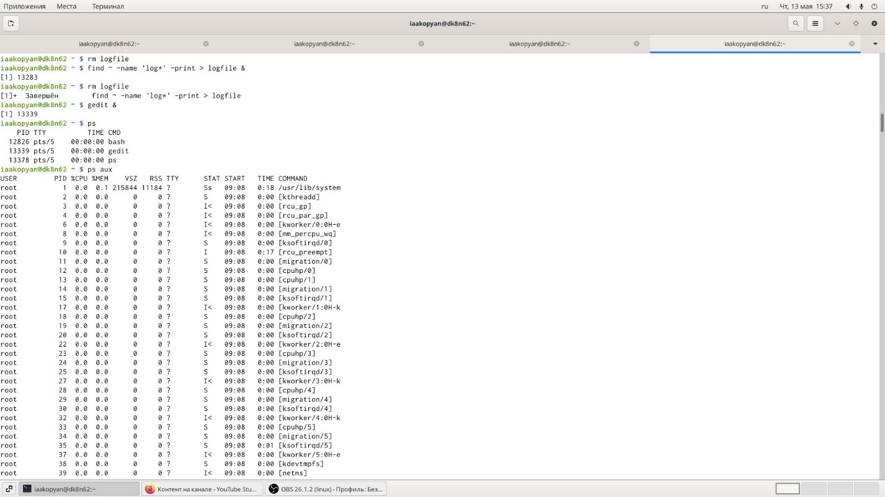{ #fig:001 width=70% }

Прочла справку о команде kill. Использовала ее без лишних опций для завершения процесса gedit.

Прочла справку о df и du. Выполнила их с опциями.

С df:

-v

Игнорируется для совместимости с версией df из System V.

-i

Вместо информации о блоках выдаётся информация об использовании inode'ов в файловой системе. Inode содержит информацию о файле: владелец, права доступа, временные штампы и местоположение на диске.

С du:

-a, --all - выводить размер для всех файлов, а не только для директорий, по умолчанию размер выводится только для папок. 

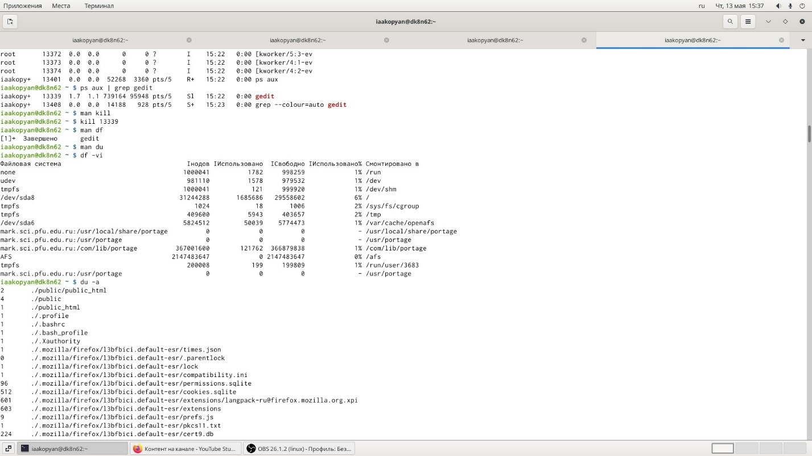{ #fig:001 width=70% }

Воспользовалась справкой команды find. Вывела имена всех директорий в домашнем каталоге (по справке find -type d -print). 

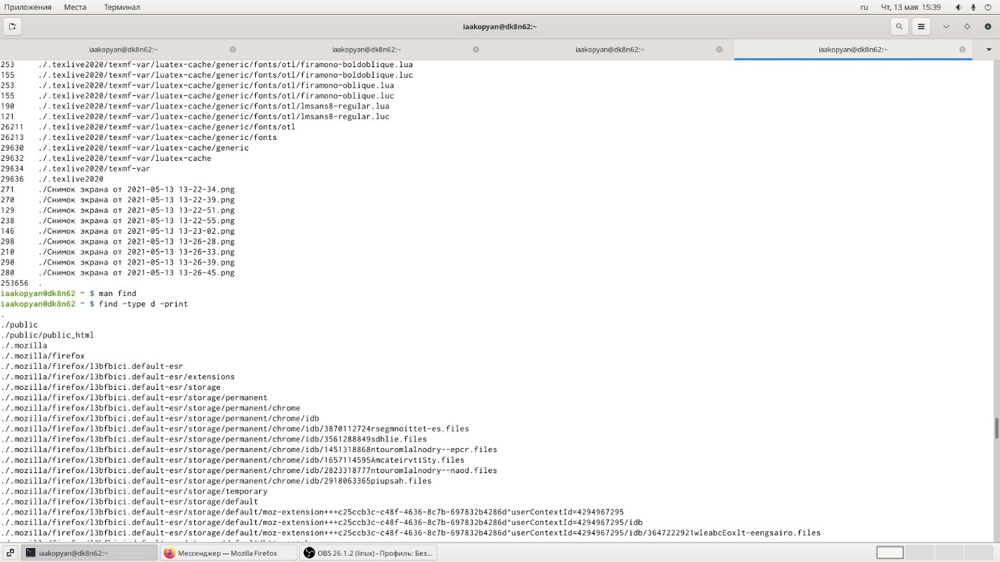{ #fig:001 width=70% }

**Справка**

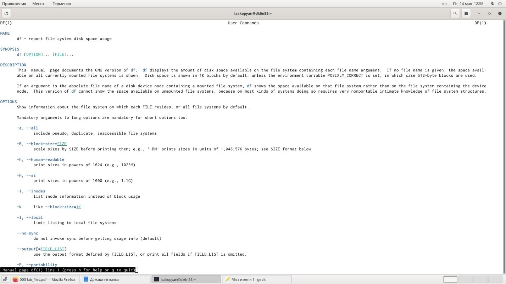{ #fig:001 width=70% }

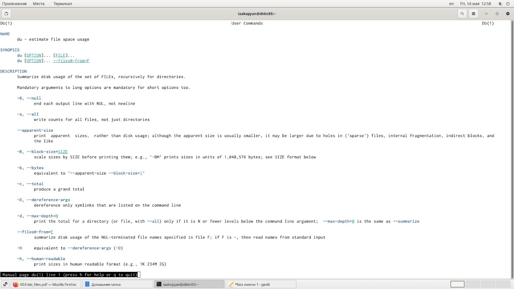{ #fig:001 width=70% }

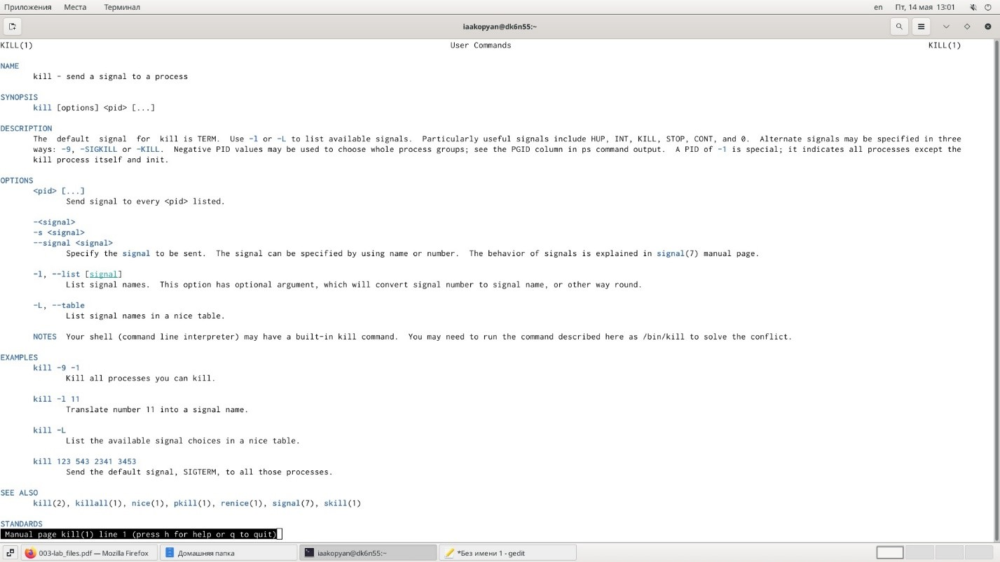{ #fig:001 width=70% }

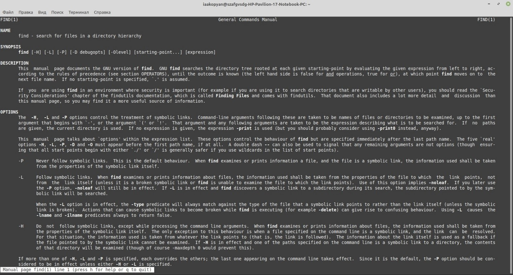{ #fig:001 width=70% }

# Вывод

Я успешно ознакомилась с инструментами поиска файлов и фильтрации текстовых данных. 

Приобрела практические навыки: по управлению процессами (и заданиями), по проверке использования диска и обслуживанию файловых систем.
