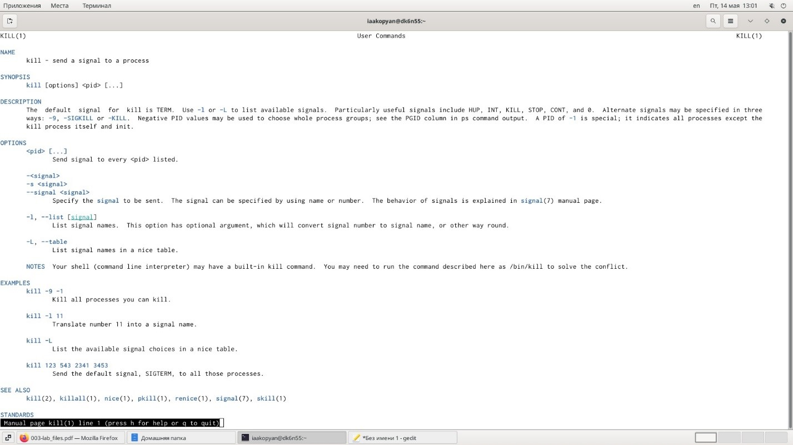

---
## Front matter
lang: ru-RU
title: Лабораторая работа 7

author: |
	Акопян Изабелла Арменовна\inst{}

institute: |
	\inst{}RUDN University, Moscow, Russian Federation

date: 2021, 15 Мая

## Formatting
toc: false
slide_level: 2
theme: metropolis
header-includes: 
 - \metroset{progressbar=frametitle,sectionpage=progressbar,numbering=fraction}
 - '\makeatletter'
 - '\beamer@ignorenonframefalse'
 - '\makeatother'
aspectratio: 43
section-titles: true
---

# Поиск файлов. Перенаправление ввода-вывода. Просмотр запущенных процессов

## Цель лабораторной работы

Ознакомление с инструментами поиска файлов и фильтрации текстовых данных. 
Приобретение практических навыков: по управлению процессами (и заданиями), по проверке использования диска и обслуживанию файловых систем.

## Задачи

- Запись в файл названия файлов в каталоге
- Добавление в файл названий файлов в каталоге
- Вывод имён файлов с определенным расширением и запись их в другой файл
- Определение файлов, название которых начинается с определенной буквы
- Запуск процессов в фоновом режиме
- Чтение необходимых справок
- Определение идентификаторов процесса gedit
- Выполнение команд df и du
- Вывод имен всех директорий

## Основная работа

{ #fig:001 width=70% }
{ #fig:001 width=70% }

##

{ #fig:001 width=70% }
{ #fig:001 width=70% }

## Полученные справки (1/2)

{ #fig:001 width=70% }
{ #fig:001 width=70% }

## Полученные справки (2/2)

{ #fig:001 width=70% }
{ #fig:001 width=70% }

## Вывод

Я успешно ознакомилась с инструментами поиска файлов и фильтрации текстовых данных. 

Приобрела практические навыки: по управлению процессами (и заданиями), по проверке использования диска и обслуживанию файловых систем.

