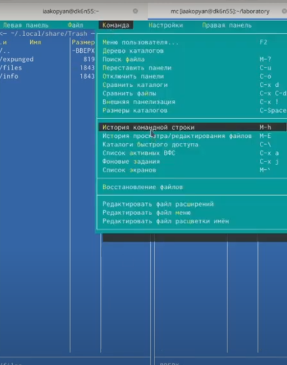

---
# Front matter
lang: ru-RU
title: "Отчет по лабораторной работе 8"
subtitle: "Командная оболочка Midnight Commander"
author: "Акопян Изабелла Арменовна"

# Formatting
toc-title: "Содержание"
toc: true # Table of contents
toc_depth: 2
lof: true # List of figures
lot: true # List of tables
fontsize: 12pt
linestretch: 1.5
papersize: a4paper
documentclass: scrreprt
polyglossia-lang: russian
polyglossia-otherlangs: english
mainfont: PT Serif
romanfont: PT Serif
sansfont: PT Sans
monofont: PT Mono
mainfontoptions: Ligatures=TeX
romanfontoptions: Ligatures=TeX
sansfontoptions: Ligatures=TeX,Scale=MatchLowercase
monofontoptions: Scale=MatchLowercase
indent: true
pdf-engine: lualatex
header-includes:
  - \linepenalty=10 # the penalty added to the badness of each line within a paragraph (no associated penalty node) Increasing the value makes tex try to have fewer lines in the paragraph.
  - \interlinepenalty=0 # value of the penalty (node) added after each line of a paragraph.
  - \hyphenpenalty=50 # the penalty for line breaking at an automatically inserted hyphen
  - \exhyphenpenalty=50 # the penalty for line breaking at an explicit hyphen
  - \binoppenalty=700 # the penalty for breaking a line at a binary operator
  - \relpenalty=500 # the penalty for breaking a line at a relation
  - \clubpenalty=150 # extra penalty for breaking after first line of a paragraph
  - \widowpenalty=150 # extra penalty for breaking before last line of a paragraph
  - \displaywidowpenalty=50 # extra penalty for breaking before last line before a display math
  - \brokenpenalty=100 # extra penalty for page breaking after a hyphenated line
  - \predisplaypenalty=10000 # penalty for breaking before a display
  - \postdisplaypenalty=0 # penalty for breaking after a display
  - \floatingpenalty = 20000 # penalty for splitting an insertion (can only be split footnote in standard LaTeX)
  - \raggedbottom # or \flushbottom
  - \usepackage{float} # keep figures where there are in the text
  - \floatplacement{figure}{H} # keep figures where there are in the text
---

# Цель работы

Освоение основных возможностей командной оболочки Midnight Commander. Приобретение навыков практической работы по просмотру каталогов и файлов; манипуляций с ними. 

# Задание

- Изучить информацию о mc и его встроенном редакторе.
- Запуск mc и изучение его структуры и меню.
- Выполнение основнымх команд панелей, подменю Файл, подменю Команда и подменю Настройки.
- Работа с файлом с помощью встроенного редактора mc.
- Включение/выключение подсветки синтаксиса, используя меню редактора.

# Выполнение лабораторной работы

**Задание по mc**

Изучила информацию о mc. Запустила из командной строки mc, изучила его структуру и меню.

{ #fig:001 width=70% }

{ #fig:001 width=70% }

{ #fig:001 width=70% }

{ #fig:001 width=70% }

{ #fig:001 width=70% }

{ #fig:001 width=70% }

{ #fig:001 width=70% }

{ #fig:001 width=70% }

{ #fig:001 width=70% }

{ #fig:001 width=70% }

{ #fig:001 width=70% }

{ #fig:001 width=70% }

{ #fig:001 width=70% }

{ #fig:001 width=70% }

{ #fig:001 width=70% }

{ #fig:001 width=70% }

*Работа с правой панелью:*

{ #fig:001 width=70% }

{ #fig:001 width=70% }

{ #fig:001 width=70% }

*Работа с подменю Файл:*

{ #fig:001 width=70% }

{ #fig:001 width=70% }

{ #fig:001 width=70% }

{ #fig:001 width=70% }

{ #fig:001 width=70% }

*Работа с подменю Команда:*

{ #fig:001 width=70% }

{ #fig:001 width=70% }

{ #fig:001 width=70% }

{ #fig:001 width=70% }

{ #fig:001 width=70% }

{ #fig:001 width=70% }

{ #fig:001 width=70% }

{ #fig:001 width=70% }

*Работа с подменю Настройки:*

{ #fig:001 width=70% }

{ #fig:001 width=70% }

{ #fig:001 width=70% }

**Задание по встроенному редактору mc**

{ #fig:001 width=70% }

Открыла файл на F4. Вставила текст.

{ #fig:001 width=70% }

Удалила строку (ctrl +y)

Выделила строку и скопировала ее на новую (F3-выделение, F5- копирование, shift+insert – вставка)

Выделила строку и перенесла ее на новую (F6)

Сохранила(F2)

Отмена последнего действия (ctrl+u, существенно ничего не изменилось, так как последнее мое действие было- сдвиг курсора)

Перешла в конец и написала рандомный текст (Ctrl+End)

Перешла в начало и написала рандомный текст (Ctrl+Home)

Сохранила и закрыла (F10)

{ #fig:001 width=70% }

Открыла файл С++.

{ #fig:001 width=70% }

{ #fig:001 width=70% }

Настройки > общие

Выключила подсветку синтаксиса. 

{ #fig:001 width=70% }

{ #fig:001 width=70% }

# Вывод

Я вполне освоила основные возможности командной оболочки Midnight Commander. 
Приобрела навыки практической работы по просмотру каталогов и файлов; манипуляций с ними
