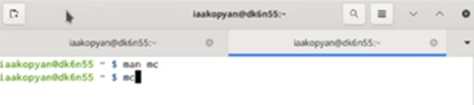
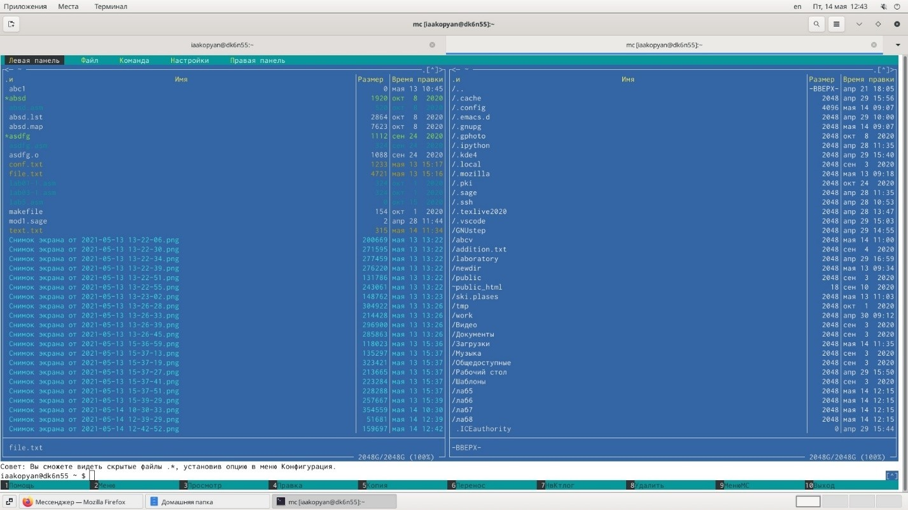
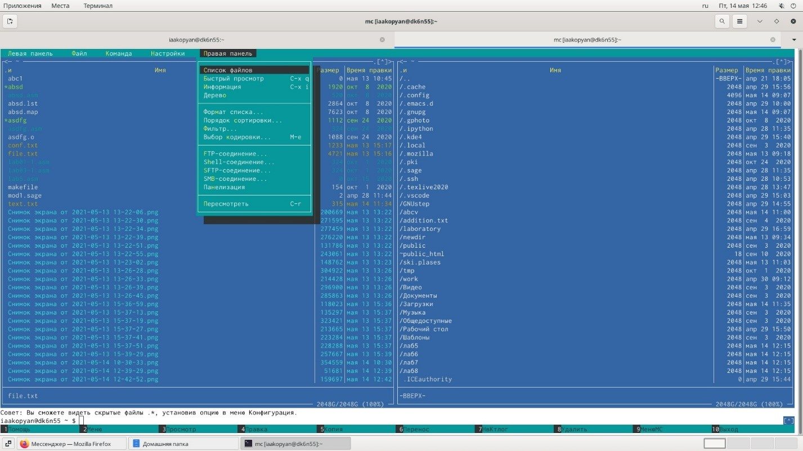
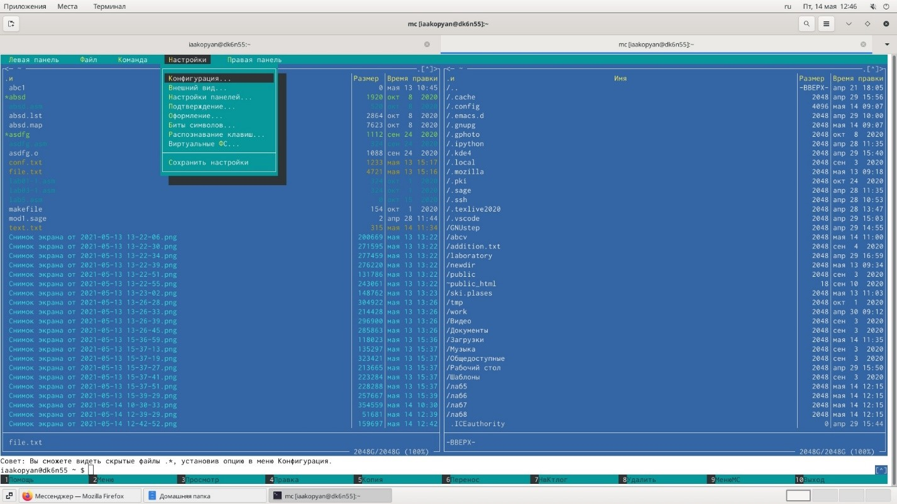
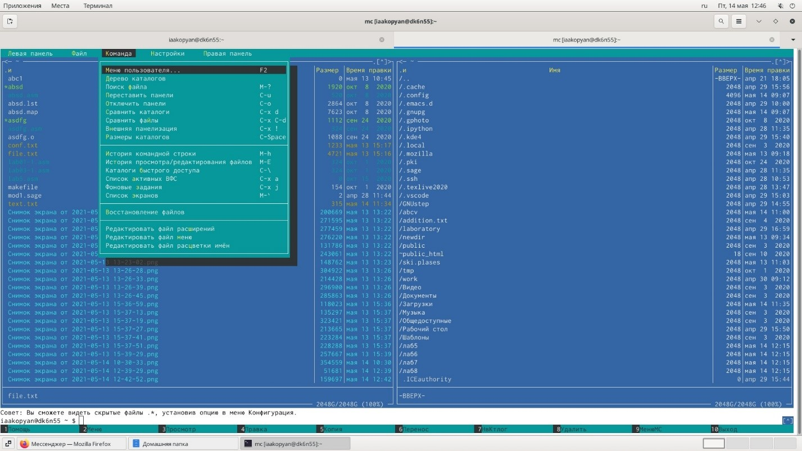
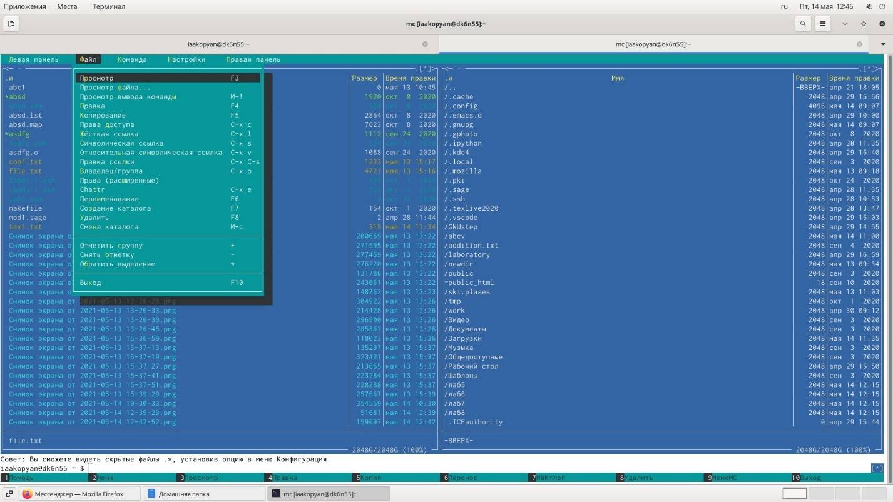
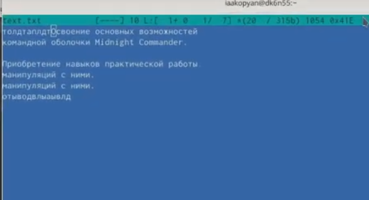
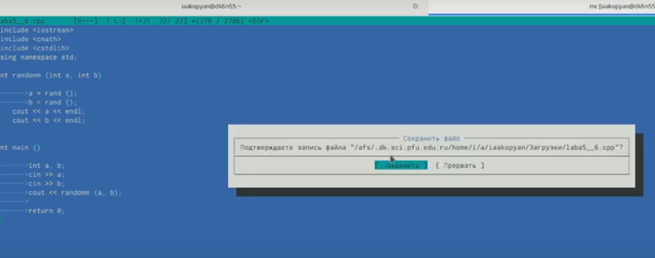

---
## Front matter
lang: ru-RU
title: Лабораторая работа 8

author: |
	Акопян Изабелла Арменовна\inst{}

institute: |
	\inst{}RUDN University, Moscow, Russian Federation

date: 2021, 15 Мая

## Formatting
toc: false
slide_level: 2
theme: metropolis
header-includes: 
 - \metroset{progressbar=frametitle,sectionpage=progressbar,numbering=fraction}
 - '\makeatletter'
 - '\beamer@ignorenonframefalse'
 - '\makeatother'
aspectratio: 43
section-titles: true
---

# Командная оболочка Midnight Commander

## Цель лабораторной работы

Освоение основных возможностей командной оболочки Midnight Commander. Приобретение навыков практической работы по просмотру каталогов и файлов; манипуляций с ними.

## Задачи

- Изучить информацию о mc и его встроенном редакторе.
- Запуск mc и изучение его структуры и меню.
- Выполнение основнымх команд панелей, подменю Файл, подменю Команда и подменю Настройки.
- Работа с файлом с помощью встроенного редактора mc.
- Включение/выключение подсветки синтаксиса, используя меню редактора.

## Задание по mc

{ #fig:001 width=70% }
{ #fig:001 width=70% }

##

{ #fig:001 width=70% }
{ #fig:001 width=70% }

##

{ #fig:001 width=70% }
{ #fig:001 width=70% }

## Задание по встроенному редактору mc

{ #fig:001 width=70% }
{ #fig:001 width=70% }

## Вывод

Я вполне освоила основные возможности командной оболочки Midnight Commander. 
Приобрела навыки практической работы по просмотру каталогов и файлов; манипуляций с ними

