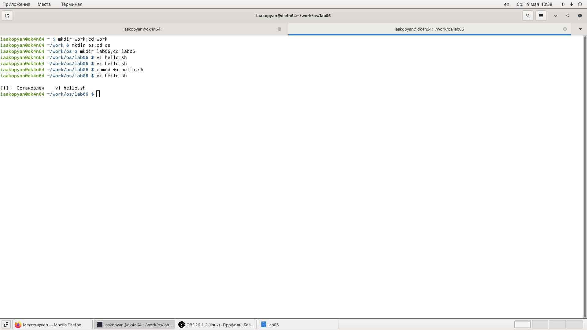
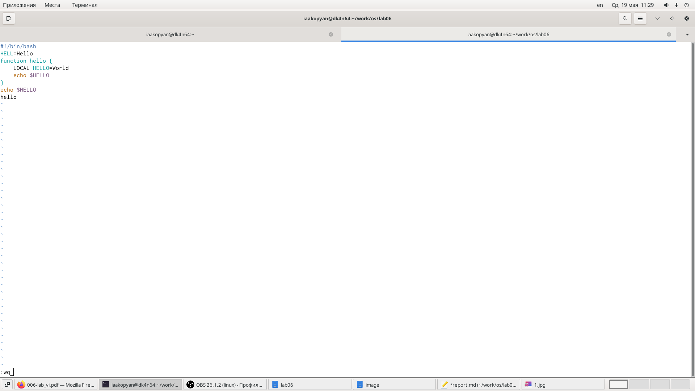
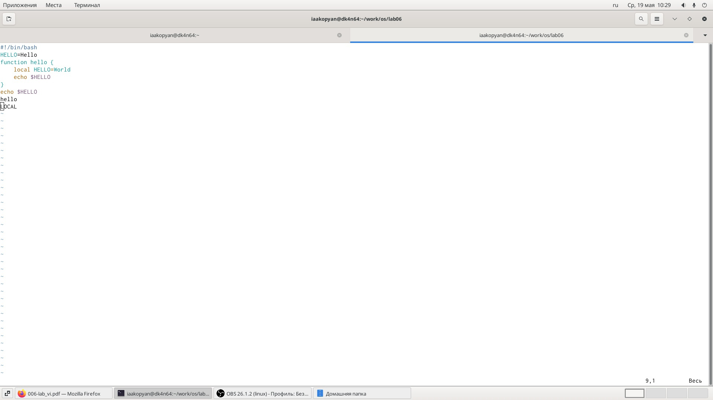

---
# Front matter
lang: ru-RU
title: "Лабораторная работа 9"
subtitle: "Текстовой редактор vi"
author: "Акопян Изабелла Арменовна"

# Formatting
toc-title: "Содержание"
toc: true # Table of contents
toc_depth: 2
lof: true # List of figures
lot: true # List of tables
fontsize: 12pt
linestretch: 1.5
papersize: a4paper
documentclass: scrreprt
polyglossia-lang: russian
polyglossia-otherlangs: english
mainfont: PT Serif
romanfont: PT Serif
sansfont: PT Sans
monofont: PT Mono
mainfontoptions: Ligatures=TeX
romanfontoptions: Ligatures=TeX
sansfontoptions: Ligatures=TeX,Scale=MatchLowercase
monofontoptions: Scale=MatchLowercase
indent: true
pdf-engine: lualatex
header-includes:
  - \linepenalty=10 # the penalty added to the badness of each line within a paragraph (no associated penalty node) Increasing the value makes tex try to have fewer lines in the paragraph.
  - \interlinepenalty=0 # value of the penalty (node) added after each line of a paragraph.
  - \hyphenpenalty=50 # the penalty for line breaking at an automatically inserted hyphen
  - \exhyphenpenalty=50 # the penalty for line breaking at an explicit hyphen
  - \binoppenalty=700 # the penalty for breaking a line at a binary operator
  - \relpenalty=500 # the penalty for breaking a line at a relation
  - \clubpenalty=150 # extra penalty for breaking after first line of a paragraph
  - \widowpenalty=150 # extra penalty for breaking before last line of a paragraph
  - \displaywidowpenalty=50 # extra penalty for breaking before last line before a display math
  - \brokenpenalty=100 # extra penalty for page breaking after a hyphenated line
  - \predisplaypenalty=10000 # penalty for breaking before a display
  - \postdisplaypenalty=0 # penalty for breaking after a display
  - \floatingpenalty = 20000 # penalty for splitting an insertion (can only be split footnote in standard LaTeX)
  - \raggedbottom # or \flushbottom
  - \usepackage{float} # keep figures where there are in the text
  - \floatplacement{figure}{H} # keep figures where there are in the text
---

# Цель работы

- Познакомиться с операционной системой Linux. 
- Получить практические навыки работы с редактором vi, установленным по умолчанию практически во всех дистрибутивах.

# Задание

- Ознакомиться с теоретическим материалом.
- Ознакомиться с редактором vi.
- Выполнить задание №1.Создание нового файла с использованием vi и №2.Редактирование существующего файла.

# Выполнение лабораторной работы

## Задание №1

Пользуясь материалами лабораторной работы, 
"[ссылка 1](https://esystem.rudn.ru/pluginfile.php/1142511/mod_resource/content/2/006-lab_vi.pdf)", 
приступаю к выполнению заданий.

Создала каталог с именем ~/work/os/lab06. (рис. -@fig:001)

Перешла в созданный каталог. (рис. -@fig:001) 

Вызвала vi и создала файл hello.sh. (рис. -@fig:001)

Нажала клавишу 'i' и ввела следующий текст:

>#!/bin/bash

>HELL=Hello

>function hello {

>    LOCALHELLO=World

>    echo $HELLO

>}

>echo $HELLO

>hello

Нажала клавишу Esc, чтобы перейти в командный режим после завершения ввода текста.

Нажала ':', чтобы перейти в режим последней строки и внизу моего экрана появилось приглашение в виде двоеточия. (рис. -@fig:002)

Нажала сначала w, потом q, чтобы записать и выйти. (рис. -@fig:002)

Сделала данный файл исполняемым. (рис. -@fig:001)

{ #fig:001 width=70% }

{ #fig:002 width=70% }

## Задание №2

Вызвала vi на редактирование этого файла. (рис. -@fig:001) 

Установила курсор в конец слова HELL второй строки (2+G, w).

Перешла в режим вставки и написала HELLO. Нажала Esc для возврата в командный режим (i).

Установила курсор на четвертую строку и стерла слово LOCAL (4+G,d+w).

Перешла в режим вставки и набрала слово 'local', нажала Esc для возврата в командный режим (i).

Установила курсор на последней строке файла. Вставила после нее строку, содержащую следующий текст: echo $HELLO (G, $, p).

Нажала Esc для перехода в командный режим.

Удалила последнюю строку (d+d).

Ввела команду отмены изменений (u).

Ввела символ ':' для перехода в режим последней строки. Записала произведенные изменения и вышла из vi.

Результат работы : (рис. -@fig:003) 

{ #fig:003 width=70% }

# Выводы

- Я успешно познакомилась с операционной системой Linux.
- Получила практические навыки работы с редактором vi.

# Библиография

[ссылка 1](https://esystem.rudn.ru/pluginfile.php/1142511/mod_resource/content/2/006-lab_vi.pdf)

