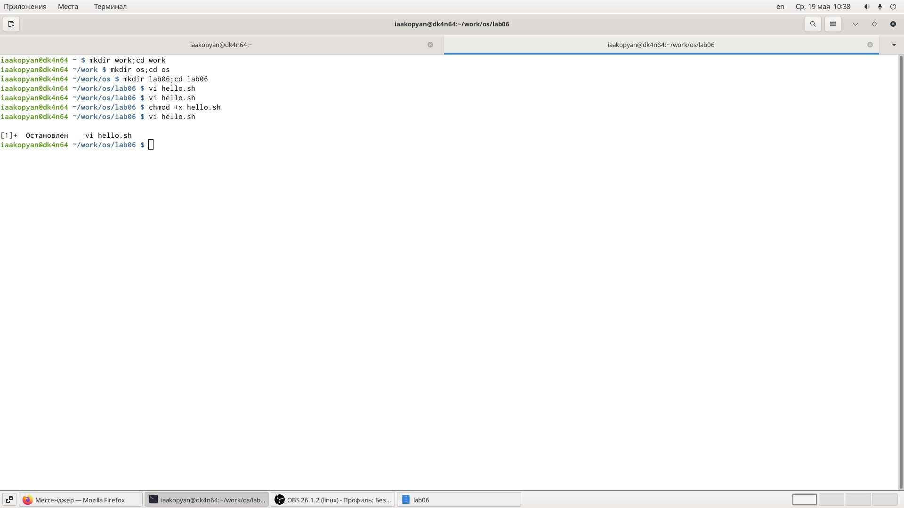
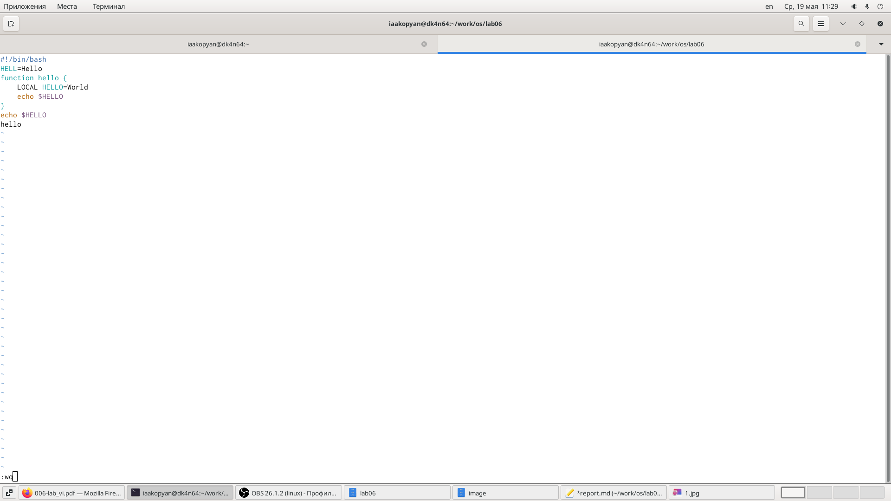
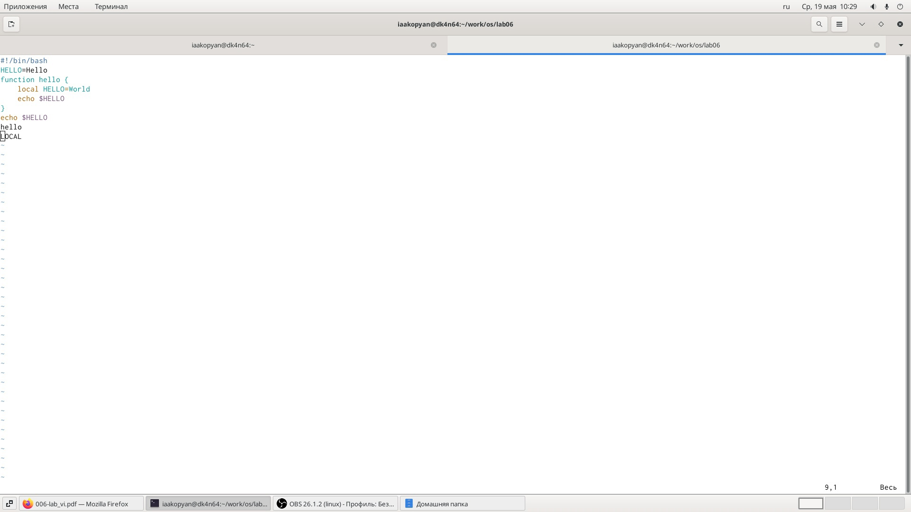

---
## Front matter
lang: ru-RU
title: Текстовой редактор vi
author: |
	Акопян Изабелла Арменовна\inst{}

institute: |
	\inst{}RUDN University, Moscow, Russian Federation
date: 2021, 19 Мая

## Formatting
toc: false
slide_level: 2
theme: metropolis
header-includes: 
 - \metroset{progressbar=frametitle,sectionpage=progressbar,numbering=fraction}
 - '\makeatletter'
 - '\beamer@ignorenonframefalse'
 - '\makeatother'
aspectratio: 43
section-titles: true
---

## Цель работы

- Познакомиться с операционной системой Linux. 
- Получить практические навыки работы с редактором vi, установленным по умолчанию практически во всех дистрибутивах.

## Задачи

- Ознакомиться с теоретическим материалом.
- Ознакомиться с редактором vi.
- Выполнить задание №1.Создание нового файла с использованием vi и №2.Редактирование существующего файла.

## Ход работы. Задание №1

{ #fig:001 width=70% }
{ #fig:002 width=70% }

## Ход работы. Задание №2

{ #fig:003 width=70% }

## Вывод

- Я успешно познакомилась с операционной системой Linux.
- Получила практические навыки работы с редактором vi.

## Библиография

[ссылка 1](https://esystem.rudn.ru/pluginfile.php/1142511/mod_resource/content/2/006-lab_vi.pdf)

