---
# Front matter
lang: ru-RU
title: "Отчет по лабораторной работе №3"
subtitle: "Markdown"
author: "Акопян Изабелла Арменовна"

# Formatting
toc-title: "Содержание"
toc: true # Table of contents
toc_depth: 2
lof: true # List of figures
lot: true # List of tables
fontsize: 12pt
linestretch: 1.5
papersize: a4paper
documentclass: scrreprt
polyglossia-lang: russian
polyglossia-otherlangs: english
mainfont: PT Serif
romanfont: PT Serif
sansfont: PT Sans
monofont: PT Mono
mainfontoptions: Ligatures=TeX
romanfontoptions: Ligatures=TeX
sansfontoptions: Ligatures=TeX,Scale=MatchLowercase
monofontoptions: Scale=MatchLowercase
indent: true
pdf-engine: lualatex
header-includes:
  - \linepenalty=10 # the penalty added to the badness of each line within a paragraph (no associated penalty node) Increasing the value makes tex try to have fewer lines in the paragraph.
  - \interlinepenalty=0 # value of the penalty (node) added after each line of a paragraph.
  - \hyphenpenalty=50 # the penalty for line breaking at an automatically inserted hyphen
  - \exhyphenpenalty=50 # the penalty for line breaking at an explicit hyphen
  - \binoppenalty=700 # the penalty for breaking a line at a binary operator
  - \relpenalty=500 # the penalty for breaking a line at a relation
  - \clubpenalty=150 # extra penalty for breaking after first line of a paragraph
  - \widowpenalty=150 # extra penalty for breaking before last line of a paragraph
  - \displaywidowpenalty=50 # extra penalty for breaking before last line before a display math
  - \brokenpenalty=100 # extra penalty for page breaking after a hyphenated line
  - \predisplaypenalty=10000 # penalty for breaking before a display
  - \postdisplaypenalty=0 # penalty for breaking after a display
  - \floatingpenalty = 20000 # penalty for splitting an insertion (can only be split footnote in standard LaTeX)
  - \raggedbottom # or \flushbottom
  - \usepackage{float} # keep figures where there are in the text
  - \floatplacement{figure}{H} # keep figures where there are in the text
---

# Цель
Изучить идеологию и применение средств контроля версий и научиться оформлять отчёты с помощью легковесного языка разметки Markdown.

# Задание
Настройка git. 
Подключение репозитория к github. 
Первичная конфигурация. 
Конфигурация git-flow. 
Сделать отчёт по предыдущей лабораторной работе в формате Markdown в pdf,docx и md.

# Выполнение лабораторной работы

**Настройка git**

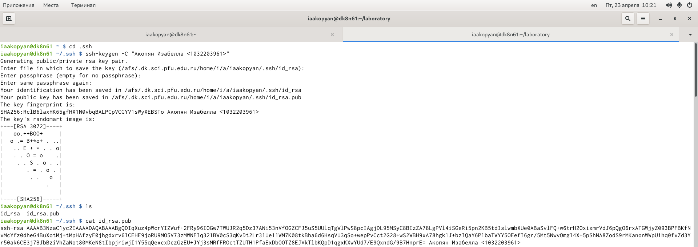{ #fig:001 width=70% }

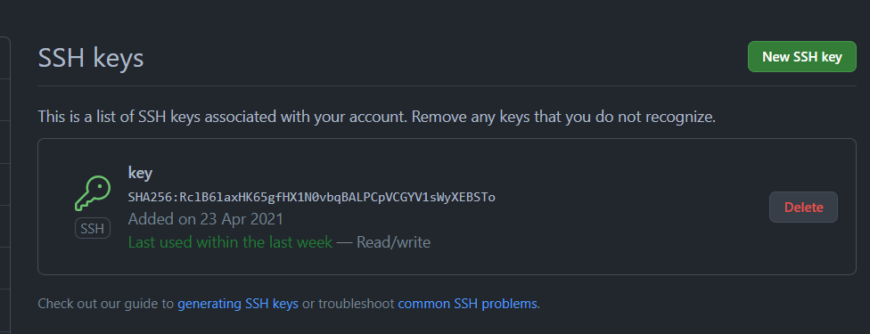{ #fig:001 width=70% }

**Подключение репозитория к github**

Создаю репозиторий. 
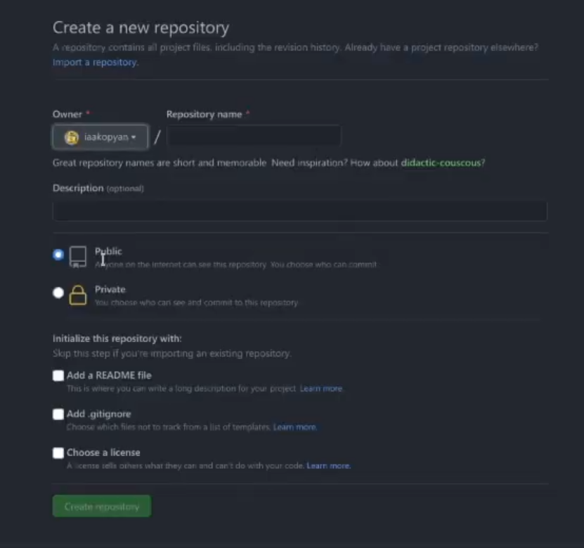{ #fig:001 width=70% }

Создала каталог laboratory. Инициализировала пустой репозиторий. И создала заготовку для файла README.md. Закоммитила.

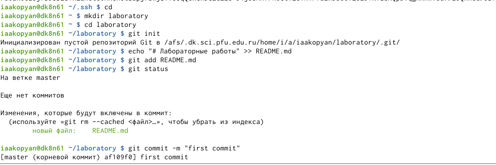{ #fig:001 width=70% }

Загрузила репозиторий из локального каталога на сервер.

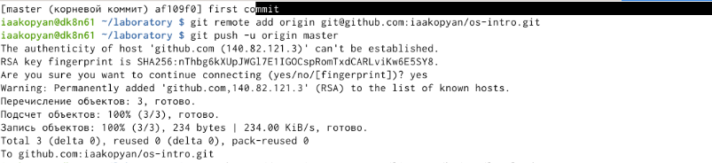{ #fig:001 width=70% }

**Первичная конфигурация**

Добавила файл лицензии (wget <ссылка> <имя>). 

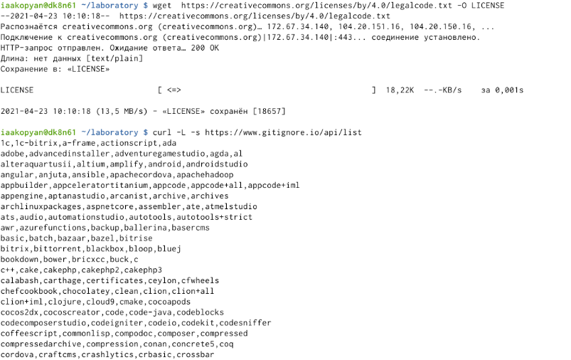{ #fig:001 width=70% }

Добавила шаблон игнорируемых файлов и шаблон для С (curl -L -s <ссылка> >> <имя>). Добавила эти файлы. Просмотрела список изменённых файлов.

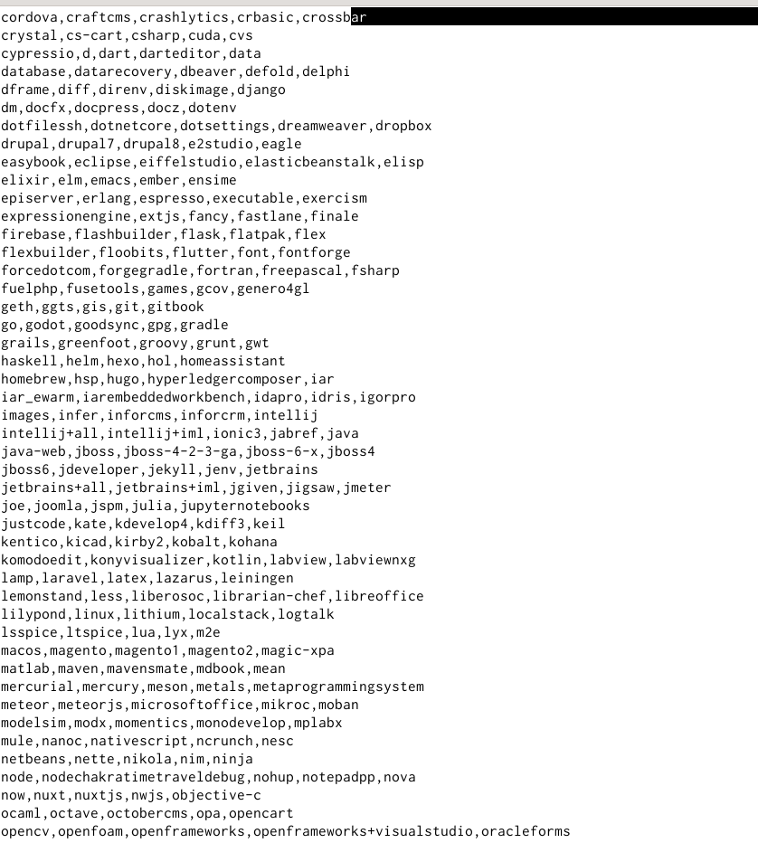{ #fig:001 width=70% }

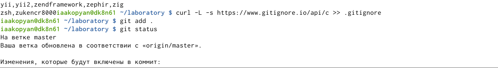{ #fig:001 width=70% }

Выполнила коммит и отправила все это на свой github.

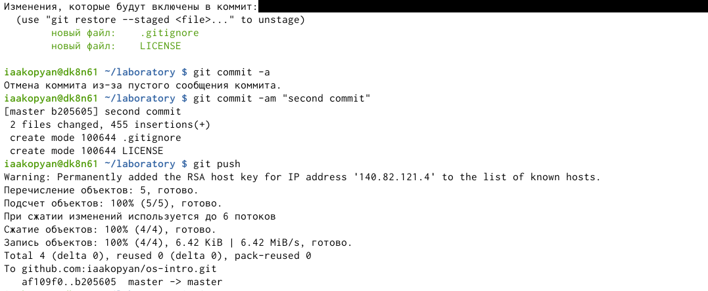{ #fig:001 width=70% }

**Конфигурация git-flow**

Инициализировала git-flow. Установила префикс для ярлыков ‘v’.

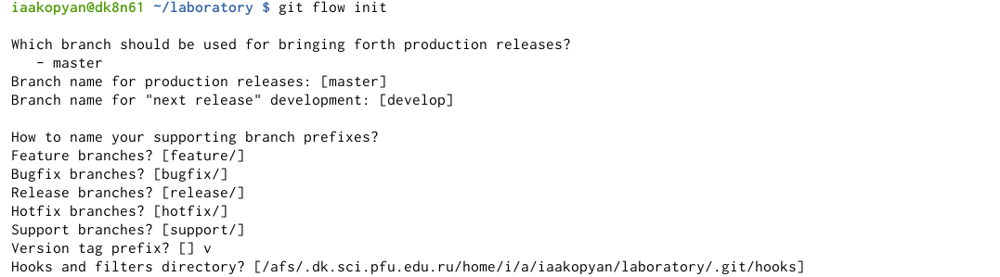{ #fig:001 width=70% }

Проверила, что я на ветке develop. Создаю релиз с версией 1.0.0.

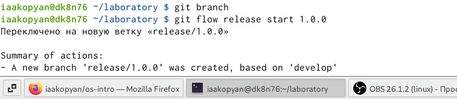{ #fig:001 width=70% }

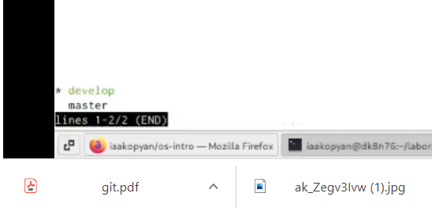{ #fig:001 width=70% }

Записала в VERSION версию '1.0.0' Добавила это все в индекс командой 'git add' и закоммитила.

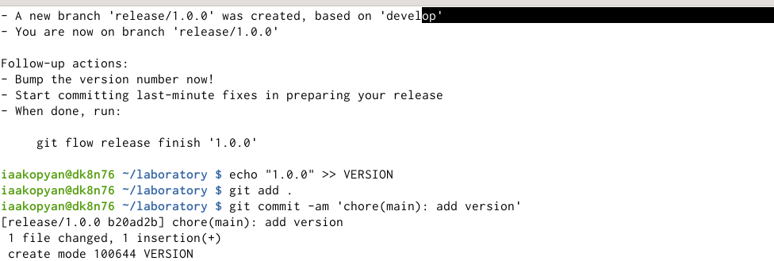{ #fig:001 width=70% }

Залила релизную ветку в основную ветку. Отправила данные на github. И в тоге создала релиз на github.

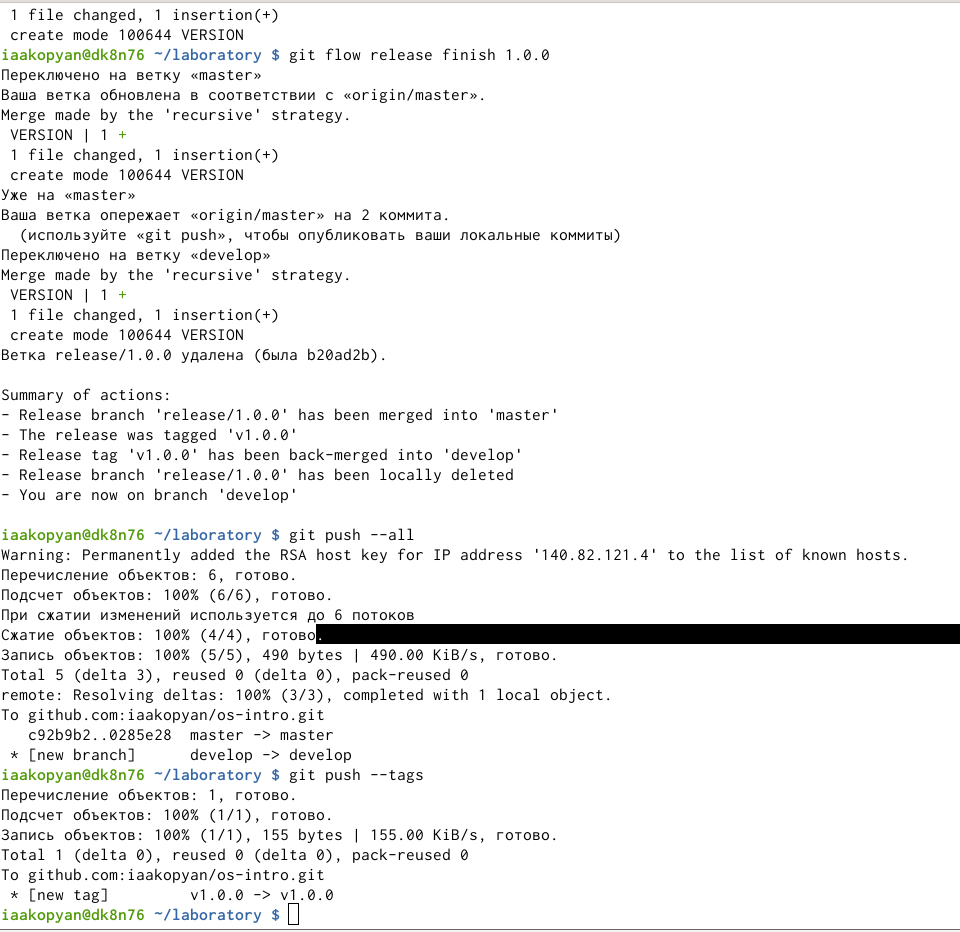{ #fig:001 width=70% }

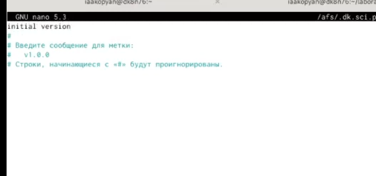{ #fig:001 width=70% }

**Результаты:**

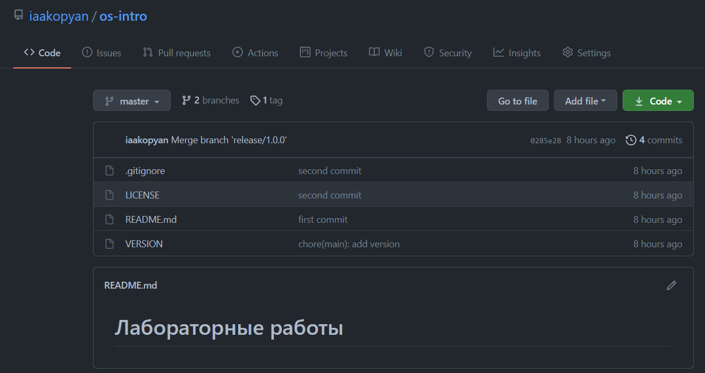{ #fig:001 width=70% }

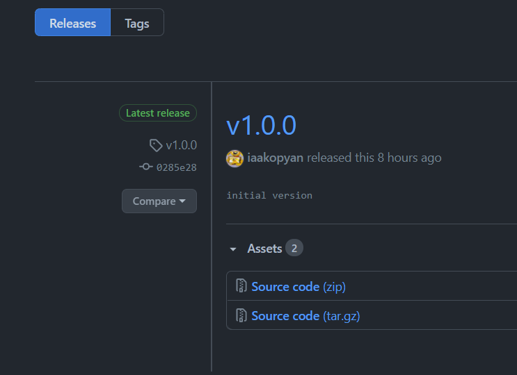{ #fig:001 width=70% }

# Вывод

В ходе работы я изучила идеологию и применение средств контроля версий и научилась работать с системой разметки Morkdown.
